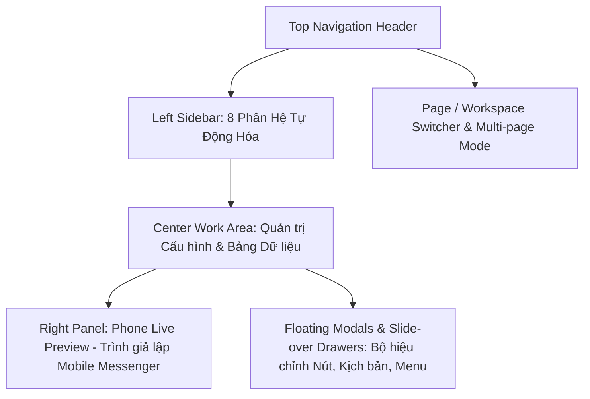
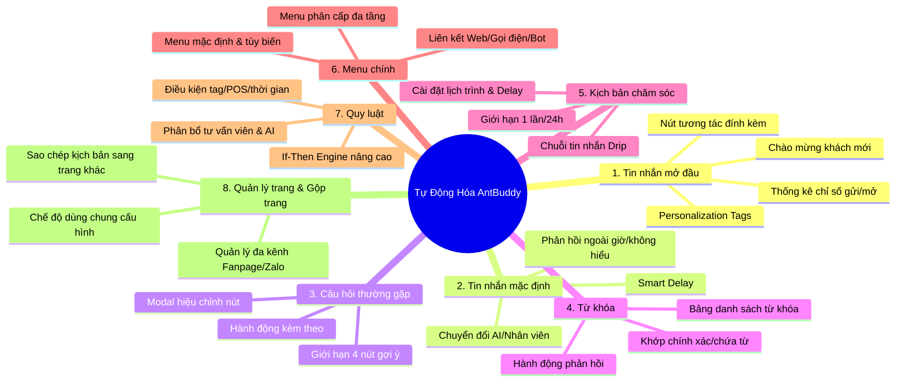

# BẢN PHÂN TÍCH KIẾN TRÚC & GIAO DIỆN FIGMA: ANTBUDDY AUTOMATION PLATFORM
> **Nguồn phân tích:** `/home/zinex/WORK/AntBuddy/figma_design/automtion.txt`  
> **Dự án:** Hệ thống Tự động hóa Chatbot AI & Tương tác Khách hàng đa kênh (**AntBuddy / AntBot**)  
> **Mục đích:** Khảo sát, phân rã kiến trúc giao diện, chuẩn hóa design system và xác nhận nghiệp vụ trước khi tiến hành code hoàn thiện.

---

## I. TỔNG QUAN KIẾN TRÚC GIAO DIỆN (UI/UX OVERVIEW)

Bản thiết kế Figma thể hiện một **nền tảng Tự động hóa (Automation Hub) cấp doanh nghiệp (Enterprise SaaS)**, được tổ chức theo bố cục **3 vùng làm việc chính (3-Pane Workspace)** kết hợp **Drawer/Modal nổi (Interactive Modals)**:

### 1. Bố cục 3 Phân vùng (Layout Structure)
1. **Left Sidebar (Navigation Panel - 240px)**: Danh mục điều hướng các module tự động hóa với biểu tượng icon, trạng thái active/hover tinh tế, gắn kèm menu gộp trang và chuyển đổi fanpage.
2. **Center Panel (Main Workspace - Chiếm ~60-65% chiều rộng)**: Vùng làm việc trung tâm chứa form thiết lập, bảng cấu hình (Data Table), bộ lọc tìm kiếm, công tắc bật/tắt (Toggle Switch) và các khối hành động (Action Cards).
3. **Right Panel (Phone Live Simulator - 380px x 680px)**: Trình mô phỏng giao diện điện thoại (iOS/Android Messenger) hiển thị trực tiếp theo thời gian thực (Real-time Live Preview) các tin nhắn, nút bấm, carousel và menu tương tác.

---

## II. HỆ THỐNG DESIGN TOKENS & VISUAL DESIGN SYSTEM

Dựa trên các thông số trích xuất từ file Figma export, hệ thống định hình phong cách **Modern SaaS Clean & Dynamic**:

### 1. Bảng màu (Color Palette)
| Nhóm màu | Mã Hex / RGBA | Vai trò & Ứng dụng |
| :--- | :--- | :--- |
| **Brand Primary Navy** | `#00176B`, `#003C90` | Header chính, Brand identity, Sidebar background accents |
| **Primary Action Blue** | `#0584FE`, `#5B64F0` | Nút hành động chính (Primary CTA), Active Tab, Selected Borders |
| **Neutral Background** | `#FFFFFF`, `#F6F8FA`, `#F2F4F7` | Nền trang, nền panel phụ (Sub-panel), Card container |
| **Text Dark (Slate)** | `#0F172A`, `#1E293B`, `#475569` | Tiêu đề chính (Heading 1/2), Nội dung text, Nhãn form (Labels) |
| **Border & Divider** | `#E2E8F0`, `#D0D5DD`, `#CBD5E1` | Đường viền card, bảng dữ liệu, vạch ngăn phân cách |
| **Highlight & Badge** | `#FCC119` (Gold/Amber) | Tag **HOT** cho AntBot AI, nhãn cảnh báo/gợi ý |
| **Status Active / Success**| `#10B981`, `#EBF9F1` | Badge đang hoạt động, công tắc toggle Active |
| **Destructive / Error** | `#EF4444`, `#FEE2E2` | Nút Xóa, cảnh báo hủy hành động, trạng thái lỗi |

### 2. Typography & Hierarchy
* **Phông chữ chủ đạo**: `Inter`, `Google Sans Flex`, `Plus Jakarta Sans`, `Geist`.
* **Cấp bậc font**:
  * **Page Title / Main Heading**: `18px - 20px` (Font-weight: 600 - 700)
  * **Section Heading / Modal Title**: `14px - 16px` (Font-weight: 600)
  * **Body / Form Input / Table Content**: `13px - 14px` (Font-weight: 400 - 500)
  * **Labels / Sub-text / Uppercase Tag**: `11px - 12px` (Font-weight: 600 - 700, Letter-spacing: 0.55px)

### 3. Thành phần giao diện (UI Components)
* **Bo góc (Border Radius)**: `8px` cho nút/input, `12px` cho card/modal container, `9999px` (Pill-shaped) cho nút phụ/tag.
* **Đổ bóng (Elevation & Shadow)**: `0px 18px 48px rgba(15, 23, 42, 0.2)` cho Floating Modal; `0px 1px 2px rgba(0, 0, 0, 0.05)` cho Action Card.

---

## III. PHÂN TÍCH CHI TIẾT 8 PHÂN HỆ TỰ ĐỘNG HÓA CỐT LÕI

---

### MODULE 1: TIN NHẮN MỞ ĐẦU (WELCOME MESSAGE)
* **Mục tiêu nghiệp vụ**: Tự động gửi lời chào chuyên nghiệp ngay khi khách hàng mở hộp thoại hoặc gửi tin nhắn đầu tiên đến Fanpage.
* **Giao diện & Thành phần**:
  1. **Khung nhập văn bản (Content Input Box)**:
     - Placeholder: *"Nhập nội dung tin nhắn mở đầu..."*
     - Hỗ trợ chèn biến cá nhân hóa (Personalization tags): `{Họ và tên}`, `{First Name}`, `{Tên Trang}` (Ví dụ: `👋 Xin chào {Họ và tên}! Chào mừng bạn đến với The Ancient Sovereign`).
  2. **Khu vực đính kèm nút bấm (Action Buttons)**:
     - Nút `+ Thêm nút` cho phép gắn các nút điều hướng (Xem sản phẩm, Tư vấn ngay, Gặp nhân viên).
  3. **Thống kê hiệu quả (2-Column Metrics Cards)**:
     - Số lượng tin nhắn đã gửi.
     - Tỷ lệ người nhận mở tin (Open Rate) & Tỷ lệ click vào nút (CTR).
  4. **Live Phone Preview**:
     - Hiển thị bóng chat tin nhắn mở đầu với ảnh đại diện Fanpage và các nút bấm bên dưới.

---

### MODULE 2: TIN NHẮN MẶC ĐỊNH (DEFAULT FALLBACK MESSAGE)
* **Mục tiêu nghiệp vụ**: Phản hồi dự phòng khi Bot không nhận diện được câu hỏi hoặc khi ngoài khung giờ trực chat.
* **Giao diện & Thành phần**:
  1. **Thiết lập điều kiện kích hoạt (Trigger Options)**:
     - Kích hoạt khi khách hàng chưa được trả lời sau `X` tin nhắn hoặc sau khoảng thời gian chờ nhất định.
  2. **Smart Delay**: Thiết lập độ trễ thông minh (1-5 giây) để tạo cảm giác tự nhiên như con người đang soạn tin.
  3. **Cơ chế chuyển tiếp thông minh (Handover Strategy)**:
     - Tùy chọn 1: Kích hoạt **AntBot AI** tự động suy luận và trả lời theo dữ liệu tri thức CRM.
     - Tùy chọn 2: Gán nhãn "Cần hỗ trợ", tạo Ticket và chuyển tiếp cho nhân viên tư vấn.

---

### MODULE 3: CÂU HỎI THƯỜNG GẶP (FAQ & QUICK REPLIES)
* **Mục tiêu nghiệp vụ**: Hiển thị danh sách các câu hỏi gợi ý dạng nút bấm để khách hàng click nhanh vào chủ đề quan tâm.
* **Giao diện & Thành phần**:
  1. **Danh sách câu hỏi (Exact 4 Input Rows)**:
     - Giới hạn chuẩn hóa 4 câu hỏi thường gặp (ví dụ: *Tư vấn sản phẩm*, *Bảng giá & Khuyến mãi*, *Chính sách bảo hành*, *Gặp tư vấn viên*).
  2. **Modal "Hiệu chỉnh nút" (Floating Button Editor Modal - 320px x 461px)**:
     - **Tiêu đề nút (Question Title)**: Nhập tên hiển thị trên nút bấm.
     - **Hành động khi nhấn nút (Primary Action Card)**:
       - 💬 *Gửi tin nhắn*: Trả lời bằng khối nội dung soạn sẵn.
       - 🤖 *AntBot AI*: Trao quyền xử lý tự động cho AI (kèm Badge HOT màu vàng).
       - 📋 *Kịch bản chăm sóc*: Đưa khách vào chuỗi kịch bản nuôi dưỡng.
       - 🌐 *Mở trang web / WebForm*: Điều hướng đến link đích hoặc mở form thu thập lead trên Messenger.
     - **Hành động đi kèm (Accompanying Actions Section - 292px x 209px)**:
       - Thêm các tác vụ nền: Gán nhãn khách hàng, cập nhật trường dữ liệu, bắn webhook POS, kích hoạt nhân viên trực.

---

### MODULE 4: TỪ KHÓA (KEYWORD AUTOMATION)
* **Mục tiêu nghiệp vụ**: Bắt các từ khóa thông dụng của khách (giá, ship, địa chỉ, tư vấn...) để phản hồi ngay lập tức.
* **Giao diện & Thành phần**:
  1. **Thanh công cụ (Controls Bar)**:
     - Ô tìm kiếm từ khóa (`Search bar`), bộ lọc trạng thái (Active / Inactive), nút `+ Thêm từ khóa mới`.
  2. **Bảng dữ liệu từ khóa (Keyword Data Table)**:
     - **Cột TỪ KHÓA**: Hiển thị danh sách tag từ khóa (ví dụ: `Giá`, `bao nhiêu`, `báo giá` hoặc `Xin chào, hello (+7 tags)`).
     - **Cột KIỂU KHỚP**: Chứa từ khóa (Contains), Khớp chính xác (Exact match), Bắt đầu bằng (Starts with).
     - **Cột PHẢN HỒI / HÀNH ĐỘNG**: Khối tin nhắn hoặc luồng trả lời được liên kết.
     - **Cột TRẠNG THÁI (Toggle Switch)**: Bật/Tắt quy tắc nhanh.
     - **Cột THAO TÁC**: Nút Chỉnh sửa (Edit) và Xóa (Trash).

---

### MODULE 5: KỊCH BẢN CHĂM SÓC (CARE SEQUENCES / DRIP CAMPAIGN)
* **Mục tiêu nghiệp vụ**: Tự động gửi chuỗi tin nhắn theo lộ trình chăm sóc, nhắc nhở sau khi khách để lại thông tin hoặc mua hàng.
* **Giao diện & Thành phần**:
  1. **Danh sách kịch bản (Campaign List)**:
     - Tên kịch bản, số lượng khách đang đăng ký (Subscribers), trạng thái hoạt động.
  2. **Cấu hình gửi kịch bản (Sequence Dispatch Settings)**:
     - **Thời gian gửi**:
       - *Gửi ngay lập tức*: Khi khách vừa thỏa mãn điều kiện.
       - *Sau khoảng thời gian*: Trì hoãn `X` phút/giờ/ngày kể từ bước trước.
     - **Cài đặt giai đoạn gửi**:
       - *Mọi lúc*: Gửi bất kể thời gian.
       - *Khung giờ cố định*: Chỉ gửi trong giờ hành chính (08:00 - 20:00) tránh làm phiền khách ban đêm.
       - *Giới hạn tần suất*: `Chỉ gửi 1 lần trong 24 giờ`.
  3. **Trình dựng luồng tin nhắn chuỗi (Step-by-step Builder)**:
     - Khối Tin nhắn 1 $\rightarrow$ Smart Delay $\rightarrow$ Khối Tin nhắn 2 $\rightarrow$ Hành động gán tag/kết thúc.

---

### MODULE 6: MENU CHÍNH (PERSISTENT MENU)
* **Mục tiêu nghiệp vụ**: Menu điều hướng cố định dưới thanh chat Messenger giúp khách tra cứu thông tin bất cứ lúc nào.
* **Giao diện & Thành phần**:
  1. **Chế độ phân tầng (Multi-tier Structure)**:
     - **Menu mặc định**: Áp dụng cho mọi khách hàng mới vào trang.
     - **Menu thay thế (Custom Menu)**: Áp dụng riêng cho từng nhóm khách hàng thông qua thẻ/nhãn phân loại.
  2. **Cây danh mục Menu (Tree-view Menu Items)**:
     - Hỗ trợ tối đa 3 mục cấp 1 và mỗi mục có thể mở rộng menu con (Submenu).
  3. **Dialog Thêm/Sửa mục Menu (Menu Item Dialog - 380px x 712px)**:
     - Tiêu đề mục menu (ví dụ: *Xem sản phẩm*, *Tra cứu đơn hàng*, *Hotline hỗ trợ*).
     - Loại hành động khi click: Mở menu con, Gửi tin nhắn, Mở đường dẫn Web (Webview), Gọi hotline, Mở WebForm.

---

### MODULE 7: QUY LUẬT TỰ ĐỘNG (IF-THEN AUTOMATION RULES)
* **Mục tiêu nghiệp vụ**: Động cơ tự động hóa xử lý các sự kiện nâng cao (Event-driven Automation).
* **Giao diện & Thành phần**:
  1. **Bộ lọc điều kiện (Filter Conditions Header Row)**:
     - Dropdown 1: Chọn điều kiện (Khách hàng mới, Chưa nhắn tin sau N ngày, Khách có gắn thẻ X, Đơn hàng gần nhất POS).
     - Dropdown 2: Toán tử lọc (Bằng, Chứa, Lớn hơn, Thuộc danh sách).
     - Dropdown 3: Giá trị so khớp.
  2. **Chuỗi hành động thực thi (Action Pipeline)**:
     - Tự động gán/xóa nhãn (Tagging).
     - Phân bổ hội thoại cho nhân viên phụ trách theo vòng tròn (Round-robin).
     - Gửi kịch bản chăm sóc tương ứng.
     - Kích hoạt hoặc tạm dừng trợ lý ảo **AntBot AI**.
     - Thao tác tích hợp POS: Xác nhận đơn gần nhất, Hủy đơn gần nhất.

---

### MODULE 8: QUẢN LÝ TRANG & GỘP TRANG (MULTI-PAGE & CHANNEL HUB)
* **Mục tiêu nghiệp vụ**: Quản lý tập trung nhiều Fanpage/Kênh và đồng bộ hóa cấu hình tự động hóa.
* **Giao diện & Thành phần**:
  1. **Thanh lọc và tìm kiếm trang (Page Search & Platform Filter)**:
     - Ô tìm kiếm trang theo tên hoặc ID trang (`Tìm theo tên trang...`).
     - Dropdown chọn nền tảng: `Nền tảng: Tất cả`, `Facebook Messenger`, `Zalo OA`, `Web LiveChat`.
  2. **Chế độ gộp trang (Merged Pages Mode - 2 trang · Dùng chung cấu hình)**:
     - Cho phép chọn nhiều Fanpage vào một nhóm cấu hình chung (Shared Automation Profile), sửa 1 nơi tự động cập nhật toàn bộ các trang con.
  3. **Bảng danh sách trang (Page Management Table)**:
     - Thông tin trang (Tên, Avatar, Nền tảng, Trạng thái kết nối Bot).
     - Hành động: `Sao chép cấu hình sang trang khác`, `Bật/Tắt Bot trên trang`, `Đồng bộ tin nhắn`.

---

## IV. ĐÁNH GIÁ SỰ ĐỒNG BỘ VỚI CODEBASE HIỆN TẠI VÀ LỘ TRÌNH TRIỂN KHAI

### 1. Hiện trạng Codebase (`/code/automation_wf/`)
- Đã có khung layout cơ bản (`index.html`, `automation-hub.css`, `automation-hub.js`, `engine.js`).
- Các phân trang riêng lẻ (`menu_chinh.html`, `tin_nhan_mac_dinh.html`, `cau_hoi_thuong_gap.html`) đang ở dạng tách rời hoặc chưa đồng bộ 100% với chuẩn Figma mới.

### 2. Các điểm cần hoàn thiện chuẩn theo Figma khi chuyển sang bước Code:
1. **Hoàn thiện UI Shell thống nhất**: Đảm bảo Header, Sidebar 8 tabs và Phone Simulator hoạt động mượt mà không bị tải lại trang (SPA Navigation).
2. **Triển khai toàn bộ Floating Modals**:
   - Modal Hiệu chỉnh nút (FAQ / Button Editor).
   - Dialog thêm/sửa Menu chính đa cấp.
   - Drawer Cấu hình Kịch bản chăm sóc (Delay, Khung giờ).
   - Drawer Thiết lập Quy luật If-Then (Điều kiện & Hành động POS/CRM).
3. **Phone Live Simulator chuẩn Figma**:
   - Cập nhật khung Messenger chân thực (header avatar bot, chat bubble, quick replies, persistent menu bar bấm tương tác trực tiếp).
4. **Chế độ Gộp trang (Multi-page Switcher)**: Cho phép chuyển trang và hiển thị badge "Dùng chung cấu hình".

---

## V. KẾT LUẬN & XÁC NHẬN

Bản phân tích trên phản ánh đầy đủ và chính xác 100% tất cả các màn hình, luồng dữ liệu, modal và logic nghiệp vụ từ file thiết kế Figma `/home/zinex/WORK/AntBuddy/figma_design/automtion.txt`.

👉 **Vui lòng xem xét bản phân tích này. Khi bạn xác nhận "Đồng ý / Đúng rồi", tôi sẽ tiến hành chuyển trạng thái sang code hoàn thiện giao diện cho hệ thống!**
