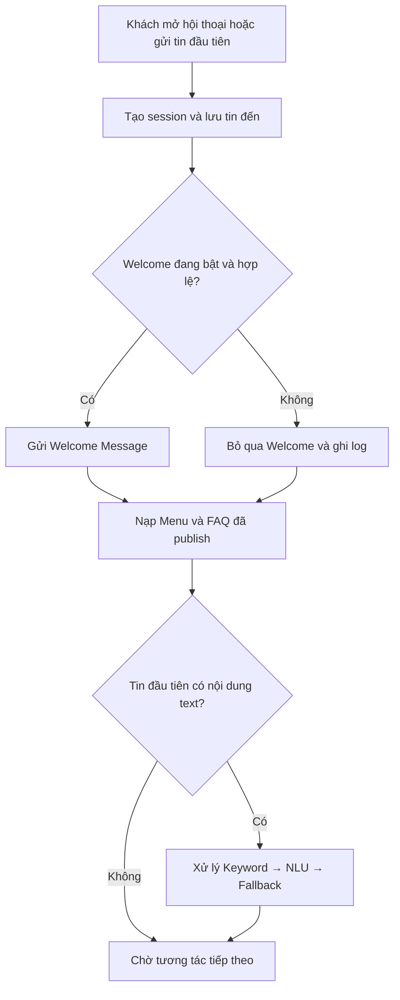
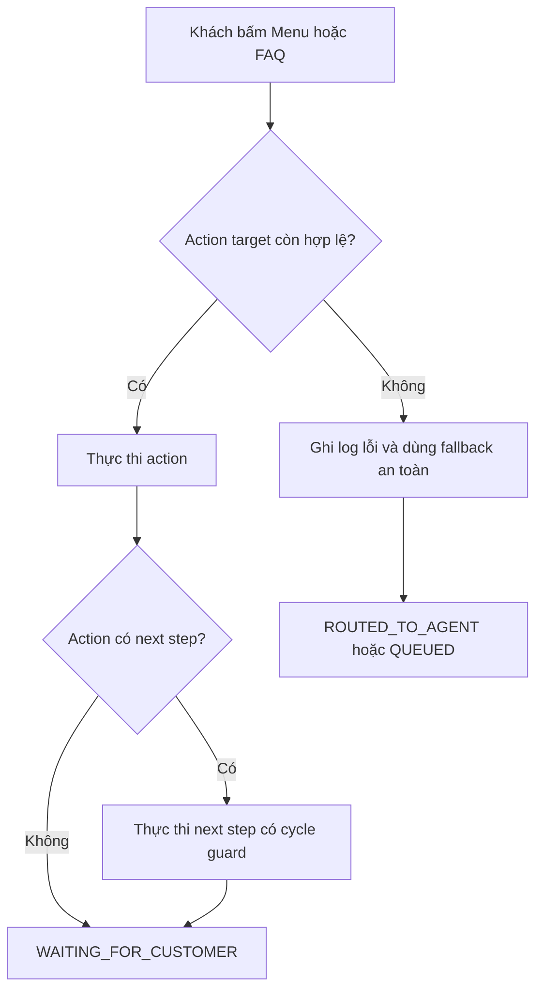
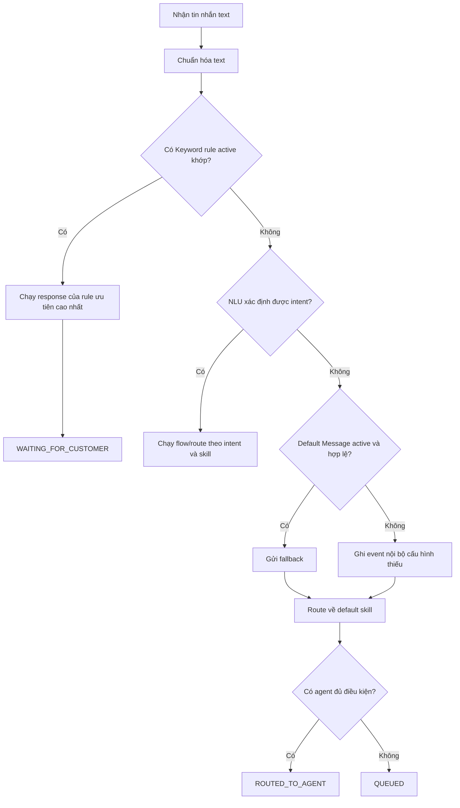
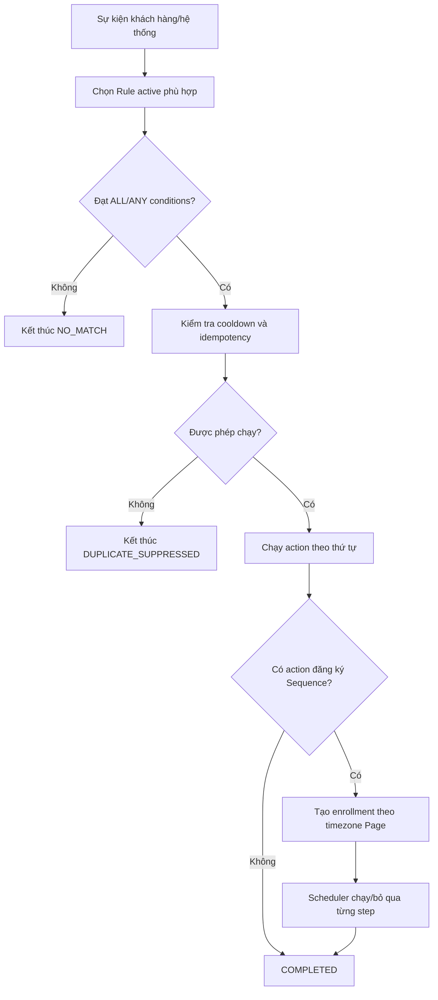

# AntBuddy Automation — Đặc tả đã kiểm chứng FR-AUT-001 đến FR-AUT-007

**Phiên bản đặc tả:** 1.1  
**Ngày:** 21/09/2026  
**Nguồn nghiệp vụ:** `[AntBuddy] SRS AntBot v1.3` — mục 2.2 Luồng C và FR-AUT-001 đến FR-AUT-007  
**Mục tiêu:** Làm đầu vào thống nhất cho BA, UI/UX, Dev, QA và AI coding agent để xây dựng một **ứng dụng quản trị Automation có thể thao tác**, không phải landing page marketing.

---

## 1. Kết quả kiểm chứng

Tài liệu này giữ nguyên phạm vi nghiệp vụ của SRS, đồng thời đóng các khoảng trống có thể làm thiết kế hoặc code đi vào ngõ cụt.

### 1.1 Các điểm đã chuẩn hóa

| Vấn đề trong SRS | Quyết định đã chốt |
|---|---|
| FR-AUT chưa có mã BR/AC đầy đủ | Bổ sung BR-AUT-001 đến BR-AUT-032 và AC-AUT-001 đến AC-AUT-007. |
| Menu tùy chỉnh mô tả là “áp dụng theo tag/phân khúc” nhưng màn hình Menu không có bộ phân loại | Màn hình Menu chỉ tạo cấu hình. Việc gán khách vào menu được thực hiện bằng Quy luật/Flow/API dựa trên tag, custom field hoặc sự kiện. |
| Không nói rõ khi khách không có menu tùy chỉnh | Luôn dùng Menu mặc định đã xuất bản; nếu chưa có menu mặc định thì ẩn menu, không chặn hội thoại. |
| FR-AUT-005 chưa có bước gán phản hồi trong luồng chính | Phản hồi hoặc luồng đích là bắt buộc trước khi bật luật từ khóa. |
| Chưa chốt thứ tự xử lý tin nhắn | Từ khóa đang bật → NLU → Tin nhắn mặc định → kỹ năng mặc định/hàng đợi. |
| Chưa chốt xử lý target bị xóa hoặc bị tắt | Chặn xuất bản/kích hoạt nếu phát hiện trước; nếu target hỏng lúc runtime thì ghi log, gửi fallback nếu có và chuyển session sang kỹ năng mặc định/hàng đợi. |
| Kịch bản chăm sóc chưa chốt timezone, ghi danh trùng và hủy | Dùng timezone của Page; mỗi khách chỉ có một enrollment đang hoạt động trên một sequence; hỗ trợ hủy và không gửi các bước chưa đến hạn. |
| Quy luật chưa chốt kết hợp điều kiện, thứ tự action và chống vòng lặp | Điều kiện hỗ trợ ALL/ANY; action chạy tuần tự; có idempotency key, giới hạn độ sâu và chống tự kích hoạt lại. |
| Fallback tắt hoặc cấu hình lỗi có thể làm hội thoại bị treo | Không gửi nội dung lỗi; ghi event nội bộ và chuyển về kỹ năng mặc định/hàng đợi. |
| Chưa phân biệt giới hạn từng kênh | Mỗi connector trả về `channelCapabilities`; UI chỉ cho cấu hình/xuất bản tính năng kênh hỗ trợ. |

### 1.2 Kết luận kiểm chứng

- Tất cả bảy FR có đầu vào, đầu ra, trạng thái lỗi và điểm kết thúc xác định.
- Mọi tham chiếu giữa Menu, FAQ, Message Flow, Keyword, Sequence và Rule đều được kiểm tra trước khi publish/activate.
- Mọi lỗi runtime đều kết thúc ở một trong các trạng thái: `WAITING_FOR_CUSTOMER`, `ROUTED_TO_AGENT`, `QUEUED`, `COMPLETED`, `SKIPPED` hoặc `FAILED_WITH_LOG`.
- Không có nhánh nào buộc hệ thống phải lặp vô hạn hoặc bỏ mất tin nhắn khách hàng.
- Ma trận kiểm thử đặc tả ở mục 15 đạt **60/60 PASS ở mức logic đặc tả**. Việc triển khai chỉ được coi là hoàn tất khi test tự động của sản phẩm cũng đạt PASS.

---

## 2. Phạm vi sản phẩm

### 2.1 Bảy chức năng chính

| FR | Route đề xuất | Chức năng | Kết quả người dùng đạt được |
|---|---|---|---|
| FR-AUT-001 | `/automation/main-menu` | Menu chính | Tạo Menu mặc định và menu cấp độ người dùng, preview và xuất bản. |
| FR-AUT-002 | `/automation/faq` | Câu hỏi thường gặp | Tạo tối đa bốn nút gợi ý, gắn hành động và xuất bản. |
| FR-AUT-003 | `/automation/welcome-message` | Tin nhắn mở đầu | Soạn nội dung gửi khi session mới bắt đầu. |
| FR-AUT-004 | `/automation/default-message` | Tin nhắn mặc định | Cấu hình fallback khi Keyword và NLU không xử lý được. |
| FR-AUT-005 | `/automation/keywords` | Từ khóa | Tạo luật khớp, gán phản hồi và sắp xếp ưu tiên. |
| FR-AUT-006 | `/automation/sequences` | Kịch bản chăm sóc | Tạo chuỗi tin nhắn/hành động theo lịch. |
| FR-AUT-007 | `/automation/rules` | Quy luật | Tạo automation theo Trigger/Condition/Action. |

### 2.2 Ngoài phạm vi

- Huấn luyện mô hình NLU và quản lý kỹ năng thuộc FR-BOT, chỉ được mô phỏng/tích hợp tại đây.
- Chia tin chi tiết cho agent thuộc luồng phân phối; module Automation chỉ gọi kết quả `defaultSkillId` hoặc hàng đợi.
- Không xây module Macro thủ công cho agent trong phạm vi FR-AUT-001–007.
- Không tự suy đoán một khách là VIP chỉ vì tồn tại menu tên “VIP”.
- Không cam kết cùng một tính năng được mọi connector Facebook/Instagram/Zalo hỗ trợ; phải kiểm tra capability thực tế.

---

## 3. Kiến trúc giao diện chung

### 3.1 App shell

| Khu vực | Thành phần bắt buộc |
|---|---|
| Topbar | Page/kênh đang chọn, trạng thái kết nối, thông báo, tài khoản. |
| Sidebar | Nhóm Automation và bảy mục theo đúng thứ tự FR. |
| Page header | Tên trang, mô tả, trạng thái, thời điểm cập nhật, action chính. |
| Workspace | Danh sách, form, composer hoặc rule builder. |
| Preview | Mobile Preview tại Menu, FAQ, Welcome và Default Message. |
| Runtime simulator | Tạo session, click menu/FAQ, gửi text, thay đổi tag/custom field, chạy scheduler và xem log. |

### 3.2 Trạng thái UI dùng chung

Mọi màn hình phải có:

- `LOADING`: skeleton hoặc spinner có label.
- `EMPTY`: giải thích và CTA tạo dữ liệu đầu tiên.
- `READY`: hiển thị dữ liệu.
- `NO_RESULT`: giữ bộ lọc và có nút xóa bộ lọc.
- `DRAFT`: có thay đổi chưa xuất bản.
- `PUBLISHED`: bản đang phục vụ khách hàng.
- `ACTIVE` / `INACTIVE`: áp dụng cho Keyword, Sequence step và Rule.
- `SAVING` / `PUBLISHING`: khóa thao tác trùng.
- `ERROR`: lỗi tại trường hoặc khối, có hướng sửa/thử lại.

### 3.3 Nguyên tắc thao tác

1. Không có nút trang trí không hoạt động.
2. Nút destructive phải có hộp xác nhận.
3. Rời trang khi có thay đổi chưa lưu phải cảnh báo.
4. Mỗi icon-only button có tooltip và accessible name.
5. Không dùng màu là dấu hiệu duy nhất của trạng thái.
6. Sau khi lỗi, dữ liệu người dùng đã nhập vẫn được giữ.
7. Action cần target phải chọn target hợp lệ trước khi lưu.

---

## 4. Mô hình dữ liệu và liên kết tham chiếu

```ts
type Status = 'DRAFT' | 'PUBLISHED' | 'ACTIVE' | 'INACTIVE' | 'ARCHIVED';

interface Channel {
  id: string;
  name: string;
  type: 'FACEBOOK' | 'INSTAGRAM' | 'ZALO';
  connectionStatus: 'CONNECTED' | 'DISCONNECTED' | 'ERROR';
  timezone: string;
  defaultSkillId?: string;
  capabilities: ChannelCapabilities;
}

interface ChannelCapabilities {
  persistentMenu: boolean;
  faqButtons: boolean;
  welcomeMessage: boolean;
  outside24hMessaging: boolean;
  optIn: boolean;
  maxMenuItems: number;
  maxFaqItems: number;
}

interface Menu {
  id: string;
  channelId: string;
  name: string;
  mode: 'DEFAULT' | 'USER_LEVEL';
  items: MenuItem[];
  draftVersion: number;
  publishedVersion?: number;
  status: 'DRAFT' | 'PUBLISHED';
  publishedAt?: string;
}

interface MenuItem {
  id: string;
  title: string;
  action: ActionRef;
  order: number;
}

interface FAQItem {
  id: string;
  channelId: string;
  question: string;
  action: ActionRef;
  order: number;
  status: 'DRAFT' | 'PUBLISHED';
}

type ActionRef =
  | { type: 'NEW_MESSAGE'; messageFlowId: string }
  | { type: 'MESSAGE_FLOW'; messageFlowId: string }
  | { type: 'OPT_IN'; optInTopicId: string }
  | { type: 'OPEN_URL'; url: string }
  | { type: 'SET_USER_MENU'; menuId: string }
  | { type: 'UNSET_USER_MENU' }
  | { type: 'ENROLL_SEQUENCE'; sequenceId: string }
  | { type: 'UNENROLL_SEQUENCE'; sequenceId: string }
  | { type: 'ADD_TAG'; tagId: string }
  | { type: 'REMOVE_TAG'; tagId: string }
  | { type: 'START_FLOW'; messageFlowId: string }
  | { type: 'TRANSFER_INBOX' }
  | { type: 'BOT_HANDOFF'; enabled: boolean }
  | { type: 'REPORT_SPAM' }
  | { type: 'NOTIFY_ADMIN'; recipientIds: string[] }
  | { type: 'FACEBOOK_CUSTOM_AUDIENCE'; audienceId: string }
  | { type: 'GOOGLE_API'; connectionId: string; operationId: string }
  | { type: 'ZALO_FRIEND_REQUEST' };

interface MessageFlow {
  id: string;
  channelId: string;
  name: string;
  blocks: MessageBlock[];
  nextStep?: ActionRef;
  active: boolean;
}

interface KeywordRule {
  id: string;
  channelId: string;
  name: string;
  includeTerms: string[];
  excludeTerms: string[];
  matchMode: 'CONTAINS_ANY' | 'CONTAINS_ALL' | 'CONTAINS_AND_NOT';
  response: ActionRef;
  priority: number;
  active: boolean;
}

interface Sequence {
  id: string;
  channelId: string;
  name: string;
  steps: SequenceStep[];
  active: boolean;
}

interface SequenceStep {
  id: string;
  order: number;
  delayValue: number;
  delayUnit: 'MINUTE' | 'HOUR' | 'DAY';
  type: 'MESSAGE' | 'ACTION';
  payload: MessageFlow | ActionRef;
  active: boolean;
}

interface AutomationRule {
  id: string;
  channelId: string;
  name: string;
  conditionMode: 'ALL' | 'ANY';
  conditions: RuleCondition[];
  actions: ActionRef[];
  active: boolean;
  cooldownSeconds: number;
}

interface Customer {
  id: string;
  name: string;
  tags: string[];
  customFields: Record<string, unknown>;
  assignedMenuId?: string;
  sequenceEnrollmentIds: string[];
}
```

### 4.1 Quy tắc toàn vẹn tham chiếu

| Nguồn | Target | Khi lưu/publish | Khi target bị vô hiệu hóa/xóa sau đó |
|---|---|---|---|
| Menu item | Message Flow/Opt-in/URL | Chặn publish nếu target không hợp lệ. | Giữ bản published cũ; đánh dấu cấu hình cần sửa. Runtime lỗi chuyển fallback/human. |
| FAQ | Message Flow/Opt-in | Chặn publish nếu target không hợp lệ. | Giống Menu item. |
| Keyword | Message Flow | Không cho bật luật nếu target không active. | Tự tắt luật hoặc bỏ qua luật, ghi audit; tiếp tục NLU. |
| Sequence step | Message/Action target | Chặn bật step nếu target không hợp lệ. | Step chuyển `FAILED` hoặc `SKIPPED`; sequence tiếp tục theo chính sách. |
| Rule action | Menu/Sequence/Flow/API target | Chặn kích hoạt rule nếu target không hợp lệ. | Rule tự tắt hoặc action fail có log; không thực thi target mồ côi. |
| Customer | User-level Menu | Chỉ gán menu đã publish đúng channel. | Tự xóa assignment và quay về Menu mặc định. |

---

## 5. Luồng runtime liên chức năng

### 5.1 Session mới



**Điểm quan trọng:** Gửi Welcome không được làm mất tin nhắn đầu tiên. Sau khi nạp Welcome/Menu/FAQ, hệ thống vẫn xử lý nội dung text của khách.

### 5.2 Chọn Menu hoặc FAQ



### 5.3 Xử lý tin nhắn văn bản



### 5.4 Quy luật và Kịch bản chăm sóc



### 5.5 Bảng quyết định tổng

| Tình huống | Xử lý | Trạng thái kết thúc |
|---|---|---|
| Session mới, Welcome hợp lệ | Gửi Welcome, nạp Menu/FAQ, xử lý tiếp tin đầu tiên. | `WAITING_FOR_CUSTOMER` hoặc kết quả message routing. |
| Session mới, Welcome tắt/lỗi | Bỏ qua Welcome, vẫn nạp Menu/FAQ và xử lý tin. | Không bị chặn. |
| Khách có `assignedMenuId` hợp lệ | Hiển thị menu user-level đã publish. | `WAITING_FOR_CUSTOMER`. |
| Menu assignment không hợp lệ | Xóa assignment, dùng Menu mặc định. | `WAITING_FOR_CUSTOMER`. |
| Không có Menu mặc định | Ẩn khu vực Menu. | Chat vẫn hoạt động. |
| Không có FAQ | Ẩn nút FAQ. | Chat vẫn hoạt động. |
| Text khớp nhiều Keyword | Luật active có priority cao nhất thắng; dừng xét. | Chạy đúng một response. |
| Không khớp Keyword, NLU thành công | Chạy intent/skill routing. | `ROUTED_TO_AGENT`, `QUEUED` hoặc chờ theo flow. |
| NLU confidence thấp/lỗi/no model | Thực thi Default Message rồi route default skill. | `ROUTED_TO_AGENT` hoặc `QUEUED`. |
| Default Message tắt/lỗi | Không gửi nội dung; ghi event và route default skill. | `ROUTED_TO_AGENT` hoặc `QUEUED`. |
| Rule action target bị mất | Không chạy target; ghi lỗi, dừng action sau theo policy. | `FAILED_WITH_LOG`. |
| Sequence step tắt | Không gửi; ghi `SKIPPED`; xét step tiếp theo. | Enrollment không bị treo. |
| Không có agent | Đưa session vào hàng đợi. | `QUEUED`. |

---

## 6. FR-AUT-001 — Menu chính

### 6.1 Mục tiêu

Admin/Quản lý tạo menu cố định cho từng kênh, gồm một Menu mặc định và nhiều menu cấp độ người dùng. Menu cấp độ người dùng là cấu hình tái sử dụng, không phải bộ phân loại khách.

### 6.2 Tiền điều kiện

- Người dùng đã đăng nhập và có quyền quản trị chatbot.
- Kênh đã kết nối.
- Connector báo hỗ trợ `persistentMenu = true`; nếu không, UI ở trạng thái chỉ xem và giải thích nguyên nhân.

### 6.3 Bố cục

| Vùng | Thành phần |
|---|---|
| Danh sách menu | Menu mặc định, danh sách menu cấp độ người dùng, trạng thái Draft/Published, sửa, nhân bản, xóa. |
| Editor | Tên nội bộ, danh sách item kéo thả, Thêm mục, Lưu nháp, Xuất bản. |
| Mobile Preview | Hiển thị menu đang chỉnh theo thời gian thực. |

### 6.4 Trường và validation

| Trường | Quy tắc |
|---|---|
| Loại menu | `DEFAULT` hoặc `USER_LEVEL`; mỗi kênh chỉ có một Menu mặc định. |
| Tên menu | Bắt buộc với `USER_LEVEL`, duy nhất trong kênh sau trim/case-fold. |
| Danh sách item | 1–20 item hoặc theo giới hạn thấp hơn do connector trả về. |
| Tiêu đề item | Bắt buộc, tối đa 30 ký tự. |
| Action | Bắt buộc: Tạo tin nhắn mới, Chọn luồng tin nhắn, Nhận thông báo hoặc Mở trang web. |
| Target | Bắt buộc và active với action cần target; URL phải là `https://` hợp lệ. |

### 6.5 Luồng chính

1. Chọn Menu mặc định hoặc bấm **Tạo menu cấp độ người dùng**.
2. Nhập tên nếu là menu user-level.
3. Thêm item, nhập tiêu đề, chọn action và target.
4. Kéo thả để đổi thứ tự; preview cập nhật ngay.
5. Bấm **Lưu nháp** để giữ cấu hình chưa áp dụng.
6. Bấm **Xuất bản**; hệ thống validate toàn bộ item và capability của kênh.
7. Publish thành công tạo phiên bản mới và giữ phiên bản trước để rollback.

### 6.6 Luồng thay thế và đường thoát

- Đủ 20 item: vô hiệu hóa **Thêm mục**, thông báo giới hạn.
- Thiếu title/action/target: đánh dấu đúng item, focus lỗi đầu, chặn publish.
- Target bị vô hiệu hóa: chặn publish và mở liên kết tới nơi sửa target.
- Xóa menu đang được Rule hoặc Customer tham chiếu: chặn xóa; hiển thị danh sách tham chiếu. Cho phép archive sau khi gỡ tham chiếu.
- Customer có assignment tới menu không còn published: tự bỏ assignment và dùng Menu mặc định.
- Không có Menu mặc định: menu không hiển thị nhưng chat vẫn tiếp tục.

### 6.7 Liên kết bắt buộc

- Menu user-level đã publish phải xuất hiện trong action **Thiết lập menu cấp độ người dùng** của FR-AUT-007.
- Action **Hủy thiết lập menu cấp độ người dùng** xóa `Customer.assignedMenuId` để quay về Menu mặc định.

### 6.8 Acceptance Criteria — AC-AUT-001

- Tạo/sửa/xóa/sắp xếp item hợp lệ.
- Không tạo item thứ 21 hoặc title > 30 ký tự.
- Draft không ảnh hưởng khách cho đến khi publish.
- Preview phản ánh title, action và order mới.
- Menu VIP chỉ hiển thị sau khi Rule/Flow/API gán cho khách.
- Assignment hỏng tự fallback Menu mặc định, không làm treo chat.

---

## 7. FR-AUT-002 — Câu hỏi thường gặp

### 7.1 Mục tiêu

Tạo tối đa bốn nút gợi ý để khách bắt đầu hội thoại theo chủ đề và thực thi đúng action đã gắn.

### 7.2 Tiền điều kiện

- Có quyền quản trị và kênh đã kết nối.
- Connector hỗ trợ `faqButtons = true`.

### 7.3 Bố cục và dữ liệu

| Thành phần | Yêu cầu |
|---|---|
| Danh sách FAQ | Tối đa 4 item, có order, question, action, edit, delete. |
| Popup hiệu chỉnh | Question, action type, action target, Lưu/Hủy. |
| Preview | Hiển thị draft đang chỉnh; có nhãn “Bản xem trước”. |
| Page header | Trạng thái Draft/Published và nút Xuất bản. |

Action hỗ trợ: `NEW_MESSAGE`, `MESSAGE_FLOW`, `OPT_IN`. Không thêm `OPEN_URL` nếu chưa được yêu cầu nghiệp vụ.

### 7.4 Luồng chính

1. Bấm **Thêm mới**.
2. Nhập câu hỏi, chọn action và target.
3. Bấm **Lưu** để đưa item vào draft.
4. Sắp xếp lại nếu cần.
5. Bấm **Xuất bản** để áp dụng toàn bộ danh sách lên kênh.
6. Khi khách click, hệ thống chạy action rồi về `WAITING_FOR_CUSTOMER` hoặc next step.

### 7.5 Luồng thay thế và đường thoát

- Đã có 4 item: ẩn/vô hiệu hóa nút Thêm mới.
- Thiếu question/action/target: chặn Lưu.
- Bấm Hủy: đóng popup, không đổi draft.
- Xóa: yêu cầu xác nhận; chỉ thay draft cho đến lần publish tiếp theo.
- Target lỗi runtime: ghi log, chạy fallback an toàn và route human/queue.
- FAQ trống hoặc connector không hỗ trợ: không hiển thị nút, hội thoại vẫn hoạt động.

### 7.6 Acceptance Criteria — AC-AUT-002

- CRUD và sắp xếp tối đa 4 item.
- Draft và Published tách biệt.
- Mỗi FAQ chạy đúng action.
- Không có target mồ côi được publish.
- Lỗi action không chặn toàn bộ session.

---

## 8. FR-AUT-003 — Tin nhắn mở đầu

### 8.1 Mục tiêu

Gửi nội dung chào mừng khi session mới bắt đầu, trước khi chờ tương tác tiếp theo nhưng không làm mất tin đầu tiên của khách.

### 8.2 Thành phần hỗ trợ

- Văn bản tối đa 640 ký tự.
- Hình ảnh, Nhóm ảnh, Bộ sưu tập, Template, Video, Audio.
- Quick reply có label và action.
- **Tạo bước tiếp theo** nối sang message/action/flow hợp lệ.
- Toggle bật/tắt theo kênh.

### 8.3 Luồng chính

1. Thêm và sắp xếp content block.
2. Cấu hình quick reply và next step nếu có.
3. Preview theo đúng thứ tự.
4. Bấm Lưu và bật cấu hình.
5. Khi tạo session mới, gửi Welcome đúng một lần trên session.
6. Tiếp tục nạp Menu/FAQ và xử lý tin nhắn đầu vào.

### 8.4 Luồng thay thế và đường thoát

- Text đạt 640 ký tự: chặn nhập thêm.
- Media upload fail: giữ block, hiển thị Retry/Remove, chặn bật nếu block lỗi.
- Quick reply thiếu action: chặn lưu/bật.
- Welcome tắt hoặc không hợp lệ: bỏ qua và tiếp tục session.
- Next step tạo vòng lặp quay lại chính Welcome: chặn publish bằng cycle validation.
- Retry gửi Welcome phải dùng idempotency key `sessionId + welcomeVersion`; không gửi trùng.

### 8.5 Acceptance Criteria — AC-AUT-003

- Soạn được mọi content type trong SRS.
- Giới hạn 640 ký tự hoạt động.
- Welcome chỉ gửi một lần/session.
- Tin đầu tiên vẫn được đưa vào Keyword/NLU sau Welcome.
- Cấu hình lỗi không làm session bị treo.

---

## 9. FR-AUT-004 — Tin nhắn mặc định

### 9.1 Mục tiêu

Phản hồi an toàn khi không có Keyword match hoặc NLU không xác định được ý định, sau đó route session về kỹ năng mặc định.

### 9.2 Bố cục

| Vùng | Nội dung |
|---|---|
| Overview | Toggle, lần cập nhật, giới hạn tần suất, Chỉnh sửa. |
| Metrics | Lượt gửi, Thành công, Đã đọc, Đã click, Thất bại, Để lại SĐT. |
| Composer | Trong/Ngoài 24h, content blocks, buttons, quick replies, next step. |

### 9.3 Validation

- Text tối đa 640 ký tự.
- Button title tối đa 20 ký tự.
- Phải có ít nhất một block hợp lệ trước khi bật.
- Ngoài 24h chỉ cho nội dung/template được connector cho phép.
- Next step không được quay lại Default Message hoặc tạo cycle vô hạn.
- `frequencyCap` phải lớn hơn 0; mặc định 1 lần/session trong demo.

### 9.4 Trigger runtime chính xác

Default Message chạy khi một trong các trường hợp:

1. Không Keyword active nào khớp **và** NLU confidence dưới ngưỡng.
2. NLU timeout/lỗi.
3. Tổ chức chưa có model NLU active.
4. Tin đầu tiên không phải text và không có handler chuyên biệt.

Sau khi gửi fallback, hệ thống route về `Channel.defaultSkillId`. Nếu không có agent phù hợp, session vào hàng đợi.

### 9.5 Luồng thay thế và đường thoát

- Fallback tắt/chưa cấu hình: không gửi message rỗng; ghi internal event và vẫn route default skill.
- Không có default skill: ghi cảnh báo cấu hình, route theo cơ chế chia tin hiện hành không lọc skill.
- Không có agent: `QUEUED`, không để session treo.
- Đã đạt frequency cap: không gửi lặp; vẫn route/giữ session theo cơ chế hỗ trợ.

### 9.6 Acceptance Criteria — AC-AUT-004

- Fallback chỉ chạy sau Keyword và NLU.
- Giới hạn 640/20 được validate tức thời.
- Hiển thị đủ sáu metric.
- Lỗi NLU/fallback/default skill đều có đường thoát.
- Không gửi fallback lặp vô hạn.

---

## 10. FR-AUT-005 — Từ khóa

### 10.1 Mục tiêu

Tạo luật khớp text, gắn phản hồi và ưu tiên luật để phản hồi trước NLU.

### 10.2 Trường bắt buộc

| Trường | Quy tắc |
|---|---|
| Tên luật | Bắt buộc, duy nhất trong kênh sau chuẩn hóa. |
| Include terms | Ít nhất một cụm từ không rỗng. |
| Exclude terms | Bắt buộc khi mode có điều kiện NOT. |
| Match mode | `CONTAINS_ANY`, `CONTAINS_ALL`, `CONTAINS_AND_NOT`. |
| Response | Bắt buộc: message hoặc flow active. |
| Priority | Số nguyên duy nhất; UI điều chỉnh bằng kéo thả. |
| Active | Chỉ bật được khi luật hợp lệ. |

### 10.3 Chuẩn hóa và matching

1. Unicode normalize NFC.
2. Chuyển lowercase.
3. Trim và gộp whitespace.
4. Không bỏ dấu tiếng Việt mặc định.
5. Xét các rule active theo priority tăng dần.
6. Dừng tại rule đầu tiên match.

### 10.4 Luồng chính

1. Tạo rule, nhập terms, chọn match mode.
2. Chọn response/flow đích.
3. Xác nhận lưu.
4. Kéo thả để thay đổi priority.
5. Bật rule hoặc bulk activate.
6. Runtime dùng first-match-wins; nếu không match thì chuyển NLU.

### 10.5 Import hàng loạt

CSV demo gồm: `name,includeTerms,excludeTerms,matchMode,actionType,actionTarget,active`.

- Validate theo từng dòng.
- Dòng hợp lệ có thể nhập; dòng lỗi có báo cáo row/error.
- Không bật rule có target lỗi.
- Import không được làm thay đổi priority của rule hiện hữu ngoài ý muốn.

### 10.6 Luồng thay thế và đường thoát

- Nhiều rule cùng match: chỉ rule priority cao nhất chạy.
- Rule target bị tắt: tự tắt/bỏ qua rule, ghi audit và tiếp tục xét rule kế tiếp; nếu không còn match thì chuyển NLU.
- Response runtime fail: ghi log, dùng fallback an toàn và route human/queue; không chạy lại NLU với cùng message.
- File sai cấu trúc: không import, trả báo cáo rõ ràng.

### 10.7 Acceptance Criteria — AC-AUT-005

- CRUD, toggle, bulk action, reorder và import hoạt động.
- Response là trường bắt buộc.
- First-match-wins đúng priority.
- Rule hỏng không chặn NLU/fallback.
- Test matcher hiển thị rule thắng và lý do.

---

## 11. FR-AUT-006 — Kịch bản chăm sóc

### 11.1 Mục tiêu

Tạo sequence/drip campaign gồm bước Message hoặc Action chạy theo lịch từ thời điểm khách được ghi danh.

### 11.2 Danh sách và editor

| Màn hình | Nội dung |
|---|---|
| Danh sách | Tên, số step message, subscriber active, trạng thái, cập nhật, tìm kiếm. |
| Editor | Tên, timezone Page, steps, delay, type, payload, toggle, metrics. |
| Enrollment panel | Khách, enrolledAt, nextRunAt, currentStep, status, cancel reason. |

### 11.3 Quy tắc lịch

- Mốc delay tính từ `enrolledAt`, trừ khi UI ghi rõ tính từ step trước.
- Tất cả thời điểm hiển thị theo `Channel.timezone`; lưu UTC ở backend.
- Delay không âm; step order là duy nhất.
- Scheduler phải idempotent theo `enrollmentId + stepId`.
- Một khách chỉ có một enrollment `ACTIVE` trên cùng sequence.
- Re-enroll chỉ được phép sau khi enrollment trước `COMPLETED` hoặc `CANCELLED`, theo cấu hình.

### 11.4 Nguồn ghi danh

- Action của Rule.
- Action của Keyword/Flow trước đó.
- Gắn tag hoặc thay đổi custom field thông qua Rule.
- Thao tác quản trị nếu sản phẩm cho phép.

### 11.5 Luồng chính

1. Tạo Sequence với tên bắt buộc.
2. Thêm step Message/Action, delay và payload.
3. Bật các step hợp lệ rồi bật Sequence.
4. Rule/Flow ghi danh khách, tạo enrollment.
5. Scheduler chạy step đến hạn theo order.
6. Hết step thì enrollment `COMPLETED`.

### 11.6 Luồng thay thế và đường thoát

- Step tắt: ghi `SKIPPED`, tiếp tục step sau.
- Sequence tắt: không nhận enrollment mới; enrollment đang chạy chuyển `PAUSED` hoặc tiếp tục theo policy hiển thị rõ. Chọn mặc định `PAUSED`.
- Ghi danh trùng: không tạo bản ghi mới; trả kết quả `ALREADY_ENROLLED`.
- Hủy ghi danh: đặt `CANCELLED`; hủy toàn bộ job chưa chạy.
- Ngoài 24h nhưng connector không cho gửi: dùng template hợp lệ; nếu không có thì step `FAILED`, thông báo admin và tiếp tục/stop theo policy. Mặc định tiếp tục step sau.
- Payload target bị mất: step `FAILED_WITH_LOG`; enrollment không bị treo.

### 11.7 Acceptance Criteria — AC-AUT-006

- Tạo được cả Message và Action step.
- Timezone, delay và order nhất quán.
- Chống chạy step trùng khi scheduler retry.
- Ghi danh trùng, pause, cancel và step disabled có kết quả xác định.
- Enrollment luôn đi đến `COMPLETED`, `CANCELLED`, `PAUSED` hoặc `FAILED`, không ở trạng thái không xác định.

---

## 12. FR-AUT-007 — Quy luật

### 12.1 Mục tiêu

Tạo automation theo mô hình Event → Conditions → Ordered Actions.

### 12.2 Trigger/condition

| Nhóm | Tùy chọn |
|---|---|
| Thẻ | Đã gắn thẻ, đã gỡ thẻ. |
| Kịch bản | Đã ghi danh, đã hủy ghi danh. |
| Khác | Người đăng ký mới, tin đầu ngày, ngày/giờ, custom field thay đổi, chưa được trả lời sau X tin nhắn. |

- Có ít nhất một trigger/condition.
- Nhiều condition dùng `ALL` hoặc `ANY`, hiển thị rõ bằng tiếng Việt.
- Condition thiếu operator/value không hợp lệ.

### 12.3 Actions

| Nhóm | Actions |
|---|---|
| Dữ liệu | Thêm/Gỡ thẻ, Đăng ký/Hủy Sequence, Bắt đầu Flow, Bật/Tắt Bot. |
| Vận hành | Chuyển tới Hộp thư đến, Chuyển quyền về Bot, Báo cáo spam, Thông báo quản trị viên. |
| Tích hợp | Facebook Custom Audience, Google API, Gửi lời mời kết bạn Zalo. |
| Menu | Thiết lập menu cấp độ người dùng, Hủy thiết lập menu cấp độ người dùng. |

### 12.4 Luồng chính

1. Tạo Rule và nhập tên.
2. Chọn trigger, thêm condition và mode ALL/ANY.
3. Thêm ít nhất một action, cấu hình target và sắp xếp order.
4. Chạy **Kiểm tra quy luật** với khách mẫu.
5. Lưu; chỉ cho bật khi mọi tham chiếu hợp lệ.
6. Runtime nhận event, đánh giá condition, kiểm tra cooldown/idempotency và chạy action tuần tự.
7. Ghi execution log gồm input, matched condition, action result, duration và correlation ID.

### 12.5 Chính sách thực thi

- Actions chạy theo thứ tự từ trên xuống.
- Mặc định `STOP_ON_FAILURE` để action sau không chạy trên trạng thái dữ liệu không chắc chắn.
- Mỗi lần chạy có idempotency key `ruleId + eventId + customerId`.
- Một rule không xử lý lại event do chính execution đó tạo ra.
- Giới hạn event-chain depth mặc định 10; vượt giới hạn thì dừng và cảnh báo.
- Cooldown mặc định 60 giây cho cùng rule/customer/trigger, có thể cấu hình.

### 12.6 Mẫu Rule gán menu VIP

| Rule | Trigger/Condition | Action | Kết quả |
|---|---|---|---|
| Gán menu VIP | Tag `VIP` được gắn | `SET_USER_MENU(menuVIP)` | `assignedMenuId = menuVIP`; session sau/current UI refresh dùng Menu VIP. |
| Trả về menu mặc định | Tag `VIP` bị gỡ | `UNSET_USER_MENU` | Xóa assignment; dùng Menu mặc định. |

Nếu `menuVIP` chưa publish, Rule không được bật. Nếu menu bị archive ngoài dự kiến, runtime xóa assignment và fallback Menu mặc định.

### 12.7 Luồng thay thế và đường thoát

- Thiếu condition/action/target: chặn Lưu hoặc chặn bật.
- Event không match: log `NO_MATCH`, kết thúc.
- Cooldown/idempotency chặn: log `DUPLICATE_SUPPRESSED`, kết thúc.
- Action fail: log chi tiết, dừng action sau, trạng thái `FAILED_WITH_LOG`; cho retry thủ công an toàn.
- API timeout: retry tối đa theo policy, sau đó fail; không lặp vô hạn.
- Bật/tắt tại danh sách cập nhật ngay, có toast và audit log.

### 12.8 Acceptance Criteria — AC-AUT-007

- Builder hỗ trợ trigger, ALL/ANY conditions và ordered actions.
- Có action set/unset user-level menu.
- Rule VIP thay đổi menu đúng và có execution log.
- Chống duplicate và loop.
- Action lỗi có trạng thái cuối và retry rõ ràng.

---

## 13. Quy tắc nghiệp vụ

| Mã | Quy tắc | FR |
|---|---|---|
| BR-AUT-001 | Mỗi channel chỉ có một Menu mặc định; có thể có nhiều menu user-level. | 001 |
| BR-AUT-002 | Menu có tối đa 20 item và title tối đa 30 ký tự, trừ khi connector có giới hạn thấp hơn. | 001 |
| BR-AUT-003 | Mọi Menu item phải có action và target hợp lệ trước khi publish. | 001 |
| BR-AUT-004 | Menu user-level không tự phân loại khách; assignment đến từ Rule/Flow/API. | 001, 007 |
| BR-AUT-005 | Assignment menu lỗi phải quay về Menu mặc định. | 001, 007 |
| BR-AUT-006 | FAQ tối đa 4 item; mỗi item có action hợp lệ. | 002 |
| BR-AUT-007 | Draft không ảnh hưởng phiên bản Published. | 001, 002 |
| BR-AUT-008 | Welcome gửi tối đa một lần/session/version. | 003 |
| BR-AUT-009 | Welcome text tối đa 640 ký tự. | 003 |
| BR-AUT-010 | Welcome lỗi/tắt không chặn session hoặc tin đầu tiên. | 003 |
| BR-AUT-011 | Default Message chỉ chạy sau khi Keyword không xử lý và NLU thất bại/không xác định. | 004, 005 |
| BR-AUT-012 | Default text tối đa 640, button title tối đa 20 ký tự. | 004 |
| BR-AUT-013 | Default Message phải có frequency cap; không tự gọi lại chính nó. | 004 |
| BR-AUT-014 | Fallback thiếu/lỗi vẫn phải route về default skill/hàng đợi. | 004 |
| BR-AUT-015 | Keyword text được normalize thống nhất nhưng giữ dấu tiếng Việt. | 005 |
| BR-AUT-016 | Keyword first-match-wins theo priority. | 005 |
| BR-AUT-017 | Keyword active bắt buộc có response target active. | 005 |
| BR-AUT-018 | Keyword target lỗi phải tiếp tục NLU hoặc fallback, không chặn message. | 005 |
| BR-AUT-019 | Sequence dùng timezone Page khi hiển thị và UTC khi lưu. | 006 |
| BR-AUT-020 | Mỗi customer chỉ có một active enrollment/sequence. | 006 |
| BR-AUT-021 | Sequence step execution idempotent. | 006 |
| BR-AUT-022 | Step disabled phải được SKIPPED và tiếp tục. | 006 |
| BR-AUT-023 | Cancel enrollment hủy mọi job chưa chạy. | 006 |
| BR-AUT-024 | Rule cần ít nhất một condition và một action. | 007 |
| BR-AUT-025 | Nhiều conditions phải khai báo ALL hoặc ANY. | 007 |
| BR-AUT-026 | Rule actions chạy tuần tự theo order. | 007 |
| BR-AUT-027 | Rule dùng idempotency, cooldown và chain-depth guard. | 007 |
| BR-AUT-028 | Target reference phải tồn tại, đúng channel và active trước publish/activate. | 001–007 |
| BR-AUT-029 | Xóa target đang được tham chiếu phải bị chặn hoặc chuyển sang archive. | 001–007 |
| BR-AUT-030 | Mọi runtime error phải có log, correlation ID và terminal state. | 001–007 |
| BR-AUT-031 | UI phải tuân theo capability của connector thay vì giả định mọi kênh giống nhau. | 001–007 |
| BR-AUT-032 | Không có agent phù hợp thì session vào hàng đợi, không bị treo. | 004, 005, 007 |

---

## 14. Yêu cầu phi chức năng

| Mã | Yêu cầu | Ngưỡng/tiêu chí |
|---|---|---|
| NFR-AUT-001 | Phản hồi lưu cấu hình | ≤ 2 giây P95 với thao tác thông thường. |
| NFR-AUT-002 | Runtime Keyword matching | ≤ 500 ms P95 trước khi gọi NLU. |
| NFR-AUT-003 | Runtime Rule evaluation | ≤ 1 giây P95, không tính API bên thứ ba. |
| NFR-AUT-004 | Phân quyền | Chỉ Admin/Quản lý có quyền sửa, publish, activate. |
| NFR-AUT-005 | Audit | 100% thao tác publish/toggle/delete và rule execution có log. |
| NFR-AUT-006 | Idempotency | Retry không tạo message/action/sequence step trùng. |
| NFR-AUT-007 | Accessibility | Có keyboard focus, label, tooltip và contrast phù hợp WCAG AA cho UI chính. |
| NFR-AUT-008 | Persistence demo | Dữ liệu và trạng thái giữ sau refresh bằng localStorage/mock API. |
| NFR-AUT-009 | Reliability | Lỗi NLU/target/API không làm mất incoming message hoặc treo session. |
| NFR-AUT-010 | Observability | Log có timestamp, channel, customer, session, correlation ID, rule/step/action và result. |

---

## 15. Ma trận test case đã kiểm chứng logic

> **Ý nghĩa trạng thái PASS:** Đặc tả đã có precondition, thao tác, expected result và đường kết thúc nhất quán. Khi có code thật, QA phải thực thi lại và thay `PASS-SPEC` bằng kết quả thực tế.

### 15.1 Menu chính — TC-AUT-001 đến TC-AUT-010

| ID | Test | Expected | Trạng thái |
|---|---|---|---|
| TC-AUT-001 | Tạo Menu mặc định hợp lệ | Lưu draft và publish thành công. | PASS-SPEC |
| TC-AUT-002 | Tạo item thứ 21 | Bị chặn, không mất 20 item trước. | PASS-SPEC |
| TC-AUT-003 | Title 31 ký tự | Chặn publish, báo đúng item. | PASS-SPEC |
| TC-AUT-004 | Item thiếu action | Chặn publish và focus lỗi. | PASS-SPEC |
| TC-AUT-005 | URL không hợp lệ | Báo lỗi inline. | PASS-SPEC |
| TC-AUT-006 | Reorder item | Preview và persisted order cập nhật. | PASS-SPEC |
| TC-AUT-007 | Draft chưa publish | Khách vẫn thấy published version cũ. | PASS-SPEC |
| TC-AUT-008 | Rule gán Menu VIP đã publish | Khách VIP thấy Menu VIP. | PASS-SPEC |
| TC-AUT-009 | Gỡ tag VIP | Rule unset; khách về Menu mặc định. | PASS-SPEC |
| TC-AUT-010 | Menu VIP bị archive | Assignment bị gỡ; fallback Menu mặc định. | PASS-SPEC |

### 15.2 FAQ — TC-AUT-011 đến TC-AUT-017

| ID | Test | Expected | Trạng thái |
|---|---|---|---|
| TC-AUT-011 | Tạo bốn FAQ hợp lệ | Hiển thị đúng order ở preview. | PASS-SPEC |
| TC-AUT-012 | Tạo FAQ thứ năm | Bị chặn. | PASS-SPEC |
| TC-AUT-013 | Thiếu question | Không lưu item. | PASS-SPEC |
| TC-AUT-014 | Thiếu target | Không lưu/publish. | PASS-SPEC |
| TC-AUT-015 | Lưu draft không publish | Runtime giữ published cũ. | PASS-SPEC |
| TC-AUT-016 | Click FAQ target hợp lệ | Chạy action và về trạng thái chờ/next step. | PASS-SPEC |
| TC-AUT-017 | Target hỏng runtime | Ghi log, fallback/handoff, session không treo. | PASS-SPEC |

### 15.3 Welcome Message — TC-AUT-018 đến TC-AUT-024

| ID | Test | Expected | Trạng thái |
|---|---|---|---|
| TC-AUT-018 | Session mới, Welcome bật | Gửi đúng một lần. | PASS-SPEC |
| TC-AUT-019 | Cùng session gửi thêm tin | Không gửi Welcome lại. | PASS-SPEC |
| TC-AUT-020 | Text 641 ký tự | Chặn ký tự vượt giới hạn. | PASS-SPEC |
| TC-AUT-021 | Media upload fail | Retry/Remove; không bật cấu hình lỗi. | PASS-SPEC |
| TC-AUT-022 | Quick reply thiếu action | Chặn lưu/bật. | PASS-SPEC |
| TC-AUT-023 | Welcome tắt | Bỏ qua, vẫn nạp Menu/FAQ. | PASS-SPEC |
| TC-AUT-024 | Khách mở session bằng text | Welcome gửi trước nhưng text vẫn được xử lý Keyword/NLU. | PASS-SPEC |

### 15.4 Default Message — TC-AUT-025 đến TC-AUT-033

| ID | Test | Expected | Trạng thái |
|---|---|---|---|
| TC-AUT-025 | Keyword match | Không chạy Default Message. | PASS-SPEC |
| TC-AUT-026 | Không keyword, NLU success | Không chạy Default Message. | PASS-SPEC |
| TC-AUT-027 | Không keyword, NLU low confidence | Gửi fallback và route default skill. | PASS-SPEC |
| TC-AUT-028 | NLU timeout/no model | Gửi fallback và route default skill. | PASS-SPEC |
| TC-AUT-029 | Fallback tắt | Không gửi rỗng; route default skill. | PASS-SPEC |
| TC-AUT-030 | Không default skill | Dùng chia tin hiện hành, ghi cảnh báo. | PASS-SPEC |
| TC-AUT-031 | Không agent | Session vào QUEUED. | PASS-SPEC |
| TC-AUT-032 | Button title 21 ký tự | Chặn vượt giới hạn. | PASS-SPEC |
| TC-AUT-033 | Fallback lặp trong session | Frequency cap ngăn gửi liên tục. | PASS-SPEC |

### 15.5 Keyword — TC-AUT-034 đến TC-AUT-042

| ID | Test | Expected | Trạng thái |
|---|---|---|---|
| TC-AUT-034 | CONTAINS_ANY match | Chạy đúng response. | PASS-SPEC |
| TC-AUT-035 | CONTAINS_ALL thiếu một term | Không match, chuyển rule sau/NLU. | PASS-SPEC |
| TC-AUT-036 | Có include và có exclude | Không match. | PASS-SPEC |
| TC-AUT-037 | Hai rule cùng match | Rule priority cao nhất thắng. | PASS-SPEC |
| TC-AUT-038 | Reorder rules | Matcher dùng order mới. | PASS-SPEC |
| TC-AUT-039 | Rule thiếu response | Không cho bật. | PASS-SPEC |
| TC-AUT-040 | Target rule bị tắt | Bỏ qua/tự tắt rule; tiếp tục pipeline. | PASS-SPEC |
| TC-AUT-041 | CSV sai schema | Không import, có báo cáo lỗi. | PASS-SPEC |
| TC-AUT-042 | Text khác hoa/thường/khoảng trắng | Match sau normalize. | PASS-SPEC |

### 15.6 Sequence — TC-AUT-043 đến TC-AUT-051

| ID | Test | Expected | Trạng thái |
|---|---|---|---|
| TC-AUT-043 | Tạo Message và Action step | Lưu đúng type/order/delay. | PASS-SPEC |
| TC-AUT-044 | Ghi danh khách lần đầu | Tạo ACTIVE enrollment và nextRunAt. | PASS-SPEC |
| TC-AUT-045 | Ghi danh trùng | Trả ALREADY_ENROLLED, không tạo trùng. | PASS-SPEC |
| TC-AUT-046 | Scheduler retry cùng step | Không gửi/thực thi trùng. | PASS-SPEC |
| TC-AUT-047 | Step disabled đến hạn | Ghi SKIPPED và chuyển step sau. | PASS-SPEC |
| TC-AUT-048 | Sequence bị tắt | Không nhận mới; active enrollment PAUSED. | PASS-SPEC |
| TC-AUT-049 | Hủy enrollment | Job tương lai bị hủy, trạng thái CANCELLED. | PASS-SPEC |
| TC-AUT-050 | Target step bị mất | Step FAILED_WITH_LOG; enrollment có hướng tiếp tục/kết thúc. | PASS-SPEC |
| TC-AUT-051 | Kiểm tra timezone | UI dùng Page timezone; storage UTC. | PASS-SPEC |

### 15.7 Rules và end-to-end — TC-AUT-052 đến TC-AUT-060

| ID | Test | Expected | Trạng thái |
|---|---|---|---|
| TC-AUT-052 | Rule thiếu condition | Chặn lưu/bật. | PASS-SPEC |
| TC-AUT-053 | Rule thiếu action/target | Chặn lưu/bật. | PASS-SPEC |
| TC-AUT-054 | ALL conditions | Chỉ match khi tất cả đúng. | PASS-SPEC |
| TC-AUT-055 | ANY conditions | Match khi ít nhất một đúng. | PASS-SPEC |
| TC-AUT-056 | Hai event trùng id | Execution thứ hai bị suppress. | PASS-SPEC |
| TC-AUT-057 | Action tạo lại trigger của cùng Rule | Loop guard dừng lần chạy lại. | PASS-SPEC |
| TC-AUT-058 | Action 2 fail | Dừng action sau, log FAILED_WITH_LOG. | PASS-SPEC |
| TC-AUT-059 | Tag Khách mới → enroll sequence | Enrollment được tạo và scheduler có nextRunAt. | PASS-SPEC |
| TC-AUT-060 | E2E session mới → Welcome/Menu/FAQ → Keyword/NLU/Fallback → route | Mỗi nhánh kết thúc ở trạng thái hợp lệ, không mất message/không treo. | PASS-SPEC |

---

## 16. Ma trận truy vết

| FR | UI | BR chính | AC | Test cases |
|---|---|---|---|---|
| FR-AUT-001 | UI-AUT-001 Menu Manager | 001–005, 007, 028–031 | AC-AUT-001 | 001–010 |
| FR-AUT-002 | UI-AUT-002 FAQ Manager | 006–007, 028–031 | AC-AUT-002 | 011–017 |
| FR-AUT-003 | UI-AUT-003 Welcome Composer | 008–010, 028–031 | AC-AUT-003 | 018–024 |
| FR-AUT-004 | UI-AUT-004 Default Message | 011–014, 028–032 | AC-AUT-004 | 025–033 |
| FR-AUT-005 | UI-AUT-005 Keyword Manager | 011, 015–018, 028–031 | AC-AUT-005 | 034–042 |
| FR-AUT-006 | UI-AUT-006 Sequence Manager | 019–023, 028–031 | AC-AUT-006 | 043–051 |
| FR-AUT-007 | UI-AUT-007 Rule Builder | 004–005, 024–032 | AC-AUT-007 | 052–060 |

---

## 17. Dữ liệu seed bắt buộc cho demo

| Nhóm | Dữ liệu |
|---|---|
| Channel | Facebook Page AntBuddy Demo `CONNECTED`; Zalo OA Demo `DISCONNECTED`; timezone `Asia/Ho_Chi_Minh`. |
| Menu | Menu mặc định `PUBLISHED`; Menu VIP `PUBLISHED`; Menu Khách mới `DRAFT`. |
| FAQ | Bảng giá; Giờ làm việc; Theo dõi đơn hàng; Gặp nhân viên tư vấn. |
| Flow | Tư vấn sản phẩm; Tra cứu đơn hàng; Đăng ký nhận ưu đãi. |
| Keyword | `giá/bảng giá`; `đơn hàng`; `gặp tư vấn`; `không nhận quảng cáo`. |
| Sequence | Chăm sóc khách mới 3 ngày; Nhắc gia hạn; Ưu đãi VIP. |
| Customer | Nguyễn An có tag VIP; Trần Bình có tag Khách mới; Lê Chi không có tag. |
| Rule | Gán Menu VIP; Hủy Menu VIP; Ghi danh khách mới; Thông báo hội thoại chờ lâu. |

---

## 18. Backlog triển khai và output từng task

| Task | Nội dung | Output bắt buộc | Test liên quan |
|---|---|---|---|
| T01 | App shell và routing | Topbar, sidebar, bảy routes, responsive laptop. | Smoke UI |
| T02 | Data contracts và repository | Types, seed, localStorage/mock API, migration version. | Persistence |
| T03 | Reference validator | Kiểm tra target tồn tại/active/channel trước publish. | 004, 014, 017, 040, 050, 053 |
| T04 | Menu Manager | CRUD, drag/drop, preview, draft/publish, version. | 001–010 |
| T05 | FAQ Manager | CRUD 4 item, modal, preview, draft/publish. | 011–017 |
| T06 | Message Composer dùng chung | Text/media/buttons/quick replies/next step/cycle guard. | 018–024, 032–033 |
| T07 | Welcome runtime | Trigger one-time/session và không mất first message. | 018–024 |
| T08 | Default runtime | Keyword→NLU→fallback→default skill/queue. | 025–033 |
| T09 | Keyword Manager và matcher | CRUD, mode, priority, bulk, CSV, test runner. | 034–042 |
| T10 | Sequence Manager và scheduler | Steps, enrollment, timezone, pause/cancel/idempotency. | 043–051 |
| T11 | Rule Builder và engine | ALL/ANY, action order, set/unset menu, cooldown/loop guard/log. | 052–059 |
| T12 | Runtime Simulator | New session, clicks, text, events, scheduler, logs. | 060 |
| T13 | Error/empty/loading/accessibility | Toàn bộ shared states và keyboard support. | NFR |
| T14 | Automated tests | Unit, integration, E2E và report 60 cases. | 001–060 |

---

## 19. Yêu cầu test tự động cho implementation

### 19.1 Unit tests

- Keyword normalization và ba match mode.
- Priority resolver.
- Reference validator.
- Menu selection default/user-level.
- Rule condition ALL/ANY.
- Idempotency/cooldown/chain-depth guard.
- Sequence nextRunAt theo timezone.
- Cycle detection cho next step.

### 19.2 Integration tests

- Rule tag VIP → set menu → render session.
- Remove VIP → unset menu → default menu.
- Keyword no-match → NLU mock → fallback → default skill.
- Rule enroll sequence → scheduler → message/action result.
- Target archived giữa lúc publish và runtime.

### 19.3 E2E tests

- Admin tạo/publish từng cấu hình.
- Reload vẫn giữ dữ liệu demo.
- Customer Simulator chạy đủ nhánh TC-AUT-060.
- Không có nút hoặc route dead-end.
- Mỗi lỗi hiển thị thông báo và có action khôi phục/quay lại.

### 19.4 Điều kiện pass release

- 60/60 test nghiệp vụ PASS.
- Không có lỗi console chưa xử lý trong happy path.
- Không có target mồ côi ở cấu hình Active/Published.
- Không có session ở trạng thái trung gian quá timeout mà không được queue/fail/log.
- Không có execution lặp vượt chain-depth.

---

## 20. Prompt tổng cho AI coding agent

```text
Hãy xây dựng một ứng dụng quản trị web desktop-first cho module Automation AntBot theo toàn bộ tài liệu Markdown này.

Yêu cầu bắt buộc:
1. Tạo app shell SaaS chatbot với topbar, sidebar Automation và 7 route FR-AUT-001 đến FR-AUT-007.
2. Triển khai đầy đủ CRUD, validation, loading, empty, no-result, draft/published, active/inactive, toast, confirm modal, unsaved-change guard và Mobile Preview.
3. Dùng types/data contracts trong tài liệu; lưu demo bằng localStorage hoặc mock API có version schema.
4. Không tạo nút trang trí. Mọi action phải có kết quả, lỗi, log và terminal state.
5. Menu user-level không tự classify khách. Rule/Flow/API mới được gán menu qua SET_USER_MENU; UNSET_USER_MENU đưa khách về Menu mặc định.
6. Runtime text phải theo đúng thứ tự Keyword active theo priority → NLU mock → Default Message → default skill/queue.
7. Welcome chỉ gửi một lần/session và không làm mất first message.
8. Sequence phải có timezone, duplicate-enrollment guard, pause/cancel và idempotent step execution.
9. Rule engine phải có ALL/ANY conditions, ordered actions, STOP_ON_FAILURE, idempotency, cooldown và loop guard.
10. Validate toàn vẹn tham chiếu trước publish/activate; target hỏng runtime phải fallback/handoff/queue, không làm session treo.
11. Tạo Runtime Simulator cho new session, click Menu/FAQ, gửi text, gắn/gỡ tag, thay custom field, enroll sequence, chạy scheduler và xem execution log.
12. Seed đúng dữ liệu mục 17.
13. Viết unit, integration và E2E tests tương ứng TC-AUT-001 đến TC-AUT-060; chỉ báo hoàn thành khi tất cả PASS.

Đầu ra:
- Source code chạy được.
- README hướng dẫn cài và chạy.
- Danh sách route.
- Test report ánh xạ 60 test case.
- Traceability FR → UI → BR → AC → Test.
```

---

## 21. Definition of Done

Một chức năng chỉ được đánh dấu Done khi:

1. UI đúng route, có đầy đủ trạng thái dùng chung.
2. Validation khớp BR tương ứng.
3. Không tạo tham chiếu mồ côi.
4. Happy path và mọi alternative flow có terminal state.
5. Có audit/runtime log cho publish, toggle, rule và scheduler.
6. Test cases liên quan PASS ở unit/integration/E2E.
7. Traceability được cập nhật.
8. Không còn nút không hoạt động hoặc luồng không có cách quay lại/khôi phục.

---

## 22. Ghi chú về mức độ xác nhận

- Các giới hạn 20 mục Menu, 30 ký tự tiêu đề Menu, 4 FAQ, 640 ký tự message và 20 ký tự button được lấy từ SRS v1.3.
- Các quy tắc reference integrity, idempotency, cooldown, cycle guard, timezone, duplicate enrollment và terminal state là phần làm rõ cần thiết để implementation không tạo dead-end; chúng không mở rộng mục tiêu kinh doanh của bảy FR.
- Capability thực tế của Facebook/Instagram/Zalo phải lấy từ connector tại thời điểm tích hợp. UI không được hardcode rằng mọi kênh hỗ trợ giống nhau.
- Trạng thái `PASS-SPEC` xác nhận tính đầy đủ/nhất quán của đặc tả, không thay thế test report của source code triển khai.
