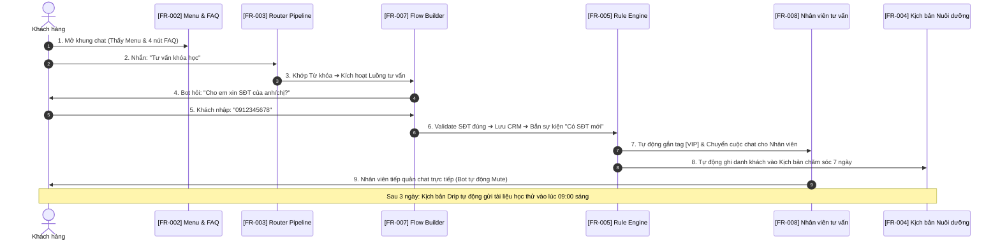

# BẢN TÓM TẮT TRỰC QUAN HỆ THỐNG AUTOMATION (EXECUTIVE SUMMARY)

> **Mục tiêu tài liệu**: Giúp bạn nắm trọn vẹn toàn bộ 10 chức năng của hệ thống Automation trong **3 phút đọc lướt**, không cần phải mở từng file đặc tả chi tiết.

---

## 1. Bản đồ Kiến trúc Tổng thể (10 Chức Năng Cốt Lõi)

Toàn bộ hệ thống Automation được phân chia thành **4 tầng vận hành chặt chẽ**:

```
┌────────────────────────────────────────────────────────────────────────────────────────┐
│                        TẦNG 1: ĐIỀU HƯỚNG TƯƠNG TÁC TRÊN KÊNH CHAT                     │
│  [FR-002] Menu chính (Persistent Menu)     │  [FR-002] Câu hỏi gợi ý (FAQ Chips)       │
│  [FR-010] Đăng ký nhận tin ngoài 24h (Opt-in Recurring Notifications)                  │
└────────────────────────────────────────┬───────────────────────────────────────────────┘
                                         │ (Khách nhắn tin / Bấm nút)
                                         ▼
┌────────────────────────────────────────────────────────────────────────────────────────┐
│                        TẦNG 2: BỘ ĐỊNH TUYẾN & TIẾP NHẬN TRUNG TÂM                     │
│  [FR-003] So khớp Từ khóa                  │  [FR-003] Lời chào phiên mới (Welcome)    │
│  [FR-003] Phản hồi dự phòng (Fallback)     │  [FR-008] Chuyển giao cho Nhân viên (Mute)│
└────────────────────────────────────────┬───────────────────────────────────────────────┘
                                         │ (Phân luồng xử lý)
                                         ▼
┌────────────────────────────────────────────────────────────────────────────────────────┐
│                        TẦNG 3: ĐỘNG CƠ XỬ LÝ & KỊCH BẢN TỰ ĐỘNG                        │
│  [FR-007] Luồng rẽ nhánh & Thu thập SĐT/Email (Interactive Flow Canvas)                │
│  [FR-004] Kịch bản nuôi dưỡng theo lịch 1-3-7 ngày (Time-based Drip Sequence)          │
│  [FR-005] Bộ máy Quy luật tức thì Sự kiện - Điều kiện - Hành động (Rule Engine ECA)    │
└────────────────────────────────────────┬───────────────────────────────────────────────┘
                                         │ (Công cụ hỗ trợ & Vận hành)
                                         ▼
┌────────────────────────────────────────────────────────────────────────────────────────┐
│                        TẦNG 4: HẠ TẦNG NỘI DUNG, ĐO LƯỜNG & NHÂN BẢN                   │
│  [FR-001] Bộ soạn tin đa phương tiện & Catalog 8 Hành động dùng chung                 │
│  [FR-009] Mẫu cấu hình đóng gói & Nhân bản cho chuỗi chi nhánh (Templates)             │
│  [FR-006] Báo cáo hiệu quả & Đo lường chuyển đổi (Unique Customers Analytics)         │
└────────────────────────────────────────────────────────────────────────────────────────┘
```

---

## 2. Bảng Tra Cứu Nhanh 10 Chức Năng (10-Second Cheat Sheet)

| Mã FR | Tên Chức Năng | Tính năng làm nhiệm vụ gì? | Kích hoạt khi nào? | Quy tắc sống còn (Dev/BA cần nhớ) |
|---|---|---|---|---|
| **FR-001** | **Biên tập Nội dung & Nút bấm** | Trình soạn tin đa bước (Text, Ảnh, Carousel, Video) + Catalog 8 Action | Mọi nơi cần gửi tin hoặc cấu hình nút | Text ≤ 640 ký tự; Nút ≤ 20 ký tự; Skip nếu vi phạm 24h. |
| **FR-002** | **Điều hướng Khung chat** | Menu cố định góc dưới chat + 4 nút FAQ gợi ý khi mở chat | Khách mở khung chat Messenger/Zalo | Menu ≤ 20 nút; FAQ ≤ 4 câu; Bấm FAQ không kích hoạt từ khóa. |
| **FR-003** | **Định tuyến Phản hồi** | Phản hồi Từ khóa + Chào khách mới + Tin mặc định (Fallback) | Khách gõ tin nhắn văn bản thông thường | Ưu tiên: Từ khóa ➔ Lời chào ➔ Tin mặc định (Rate limit 15p). |
| **FR-004** | **Kịch bản Nuôi dưỡng** | Gửi chuỗi tin sau 1 ngày, 3 ngày, 7 ngày theo lịch trình | Khách được đưa vào kịch bản (Enroll) | Chỉ gửi 08:30-18:00 (dời lịch đêm); Dừng ngay khi khách mua hàng. |
| **FR-005** | **Bộ máy Quy luật (ECA)** | Tự động phản ứng: KHI có sự kiện ➔ NẾU đúng điều kiện ➔ THÌ chạy Action | Khi dữ liệu khách đổi (gắn tag, SĐT...) | Thực thi tuần tự; Ngắt chuỗi ở cấp 5 chống lặp vô hạn. |
| **FR-006** | **Đo lường & Báo cáo** | Thống kê: Người dùng, Đã gửi, Đã đọc, Đã click, Để lại SĐT | Khách tương tác thật trên kênh | Đếm theo Khách duy nhất (Unique); Preview không sinh số liệu. |
| **FR-007** | **Luồng Tương tác & Hỏi đáp** | Bot hỏi từng câu thu thập SĐT, Email và lưu tự động vào CRM | Khi kích hoạt một kịch bản Flow | Tự động validate SĐT/Email; Nhập sai quá 3 lần chuyển nhân viên. |
| **FR-008** | **Chuyển giao Nhân viên** | Chuyển chat cho người thật, tạm dừng bot tránh nói xen vào | Khách đòi gặp người thật hoặc bot bí | Gán cờ `isBotMuted = true`; Bật lại bot khi nhân viên đóng chat. |
| **FR-009** | **Mẫu Cấu hình (Templates)** | Đóng gói toàn bộ kịch bản xuất sang Fanpage chi nhánh khác | Khi nhân bản trang hoặc dùng mẫu ngành | Khi nạp sang trang mới, cấu hình luôn ở trạng thái `DRAFT` / `OFF`. |
| **FR-010** | **Đăng ký Nhận tin (Opt-in)** | Xin quyền gửi tin thông báo định kỳ ngoài cửa sổ 24 giờ | Khách bấm nút nhận tin khuyến mãi | Có token mới được gửi ngoài 24h; Khách Opt-out phải ngừng ngay. |

---

## 3. Cây Quyết Định (Khi nào dùng chức năng nào?)

Dùng sơ đồ này để tra cứu ngay tính năng cần sử dụng cho từng bài toán nghiệp vụ:

```
BẠN MUỐN LÀM GÌ?
 │
 ├── 1. Khách mở chat lần đầu, muốn hiển thị lựa chọn ngay?
 │     ├── Thanh menu cố định dưới góc? ─────────────► [FR-002: Menu chính]
 │     └── Nút bấm gợi ý câu hỏi nổi trên chat? ─────► [FR-002: FAQ Chips]
 │
 ├── 2. Khách tự gõ tin nhắn vào khung chat?
 │     ├── Khách hỏi đúng câu quen thuộc (giá, địa chỉ)? ──► [FR-003: Từ khóa]
 │     ├── Khách mới nhắn lần đầu, cần chào đón? ──────────► [FR-003: Tin mở đầu]
 │     └── Bot không hiểu khách nói gì? ───────────────────► [FR-003: Tin mặc định có Rate Limit]
 │
 ├── 3. Muốn chăm sóc khách theo thời gian?
 │     ├── Gửi tin sau 1 ngày, 3 ngày, 7 ngày? ────────────► [FR-004: Kịch bản Chăm sóc]
 │     └── Muốn gửi tin khuyến mãi ngoài 24h hợp lệ? ─────► [FR-010: Opt-in Notifications]
 │
 ├── 4. Khách để lại SĐT hoặc mua hàng, muốn xử lý tức thì?
 │     └── Tự động gắn tag, đổi menu, chia việc cho Sale? ──► [FR-005: Bộ máy Quy luật ECA]
 │
 ├── 5. Muốn bot hỏi lần lượt: Tên -> SĐT -> Địa chỉ? ──────► [FR-007: Luồng Thu thập Dữ liệu]
 │
 ├── 6. Khách muốn chat với người thật? ────────────────────► [FR-008: Chuyển giao & Mute Bot]
 │
 └── 7. Mở thêm 10 chi nhánh mới, muốn copy cấu hình? ──────► [FR-009: Mẫu cấu hình Templates]
```

---

## 4. Hành Trình Khách Hàng Xuyên Suốt (End-to-End Runtime Pipeline)

Sơ đồ thể hiện cách 10 chức năng phối hợp mượt mà khi khách hàng thực tế vào chat:



---

## 5. Phân Biệt Các Khái Niệm Dễ Nhầm Lẫn

1. **[FR-004] Kịch bản Chăm sóc** vs **[FR-005] Bộ máy Quy luật**:
   - *Kịch bản*: Chạy theo **trục thời gian dài hạn** (sau 1 ngày, 3 ngày, hẹn giờ làm việc).
   - *Quy luật*: Chạy theo **sự kiện tức thì** (vừa có SĐT ➔ gắn thẻ ngay lập tức trong 0.1 giây).

2. **[FR-003] Từ khóa** vs **[FR-007] Luồng Tương tác**:
   - *Từ khóa*: Một câu hỏi ➔ Một câu trả lời nhanh (1 bước).
   - *Luồng*: Cuộc trò chuyện nhiều bước có rẽ nhánh, hỏi đáp và thu thập dữ liệu (Multi-step dialog).

3. **[FR-002] Menu chính** vs **[FR-002] FAQ Chips**:
   - *Menu chính*: Cố định 24/7 cạnh ô gõ phím, khách bấm lúc nào cũng được.
   - *FAQ Chips*: Chỉ nổi lên khi bắt đầu trò chuyện, biến mất khi khách đã bắt đầu chat.

---

> Toàn bộ 10 chức năng chi tiết dạng bảng đã được lưu tại:
> - **Thư mục bảng tinh gọn:** [tai_lieu_chuc_nang/tinh_gon/](file:///home/zinex/WORK/AntBuddy/code/automation_wf/Document_SRS/automation/claude/tai_lieu_chuc_nang/tinh_gon/)
> - **Thư mục bảng đầy đủ:** [tai_lieu_chuc_nang/](file:///home/zinex/WORK/AntBuddy/code/automation_wf/Document_SRS/automation/claude/tai_lieu_chuc_nang/)
