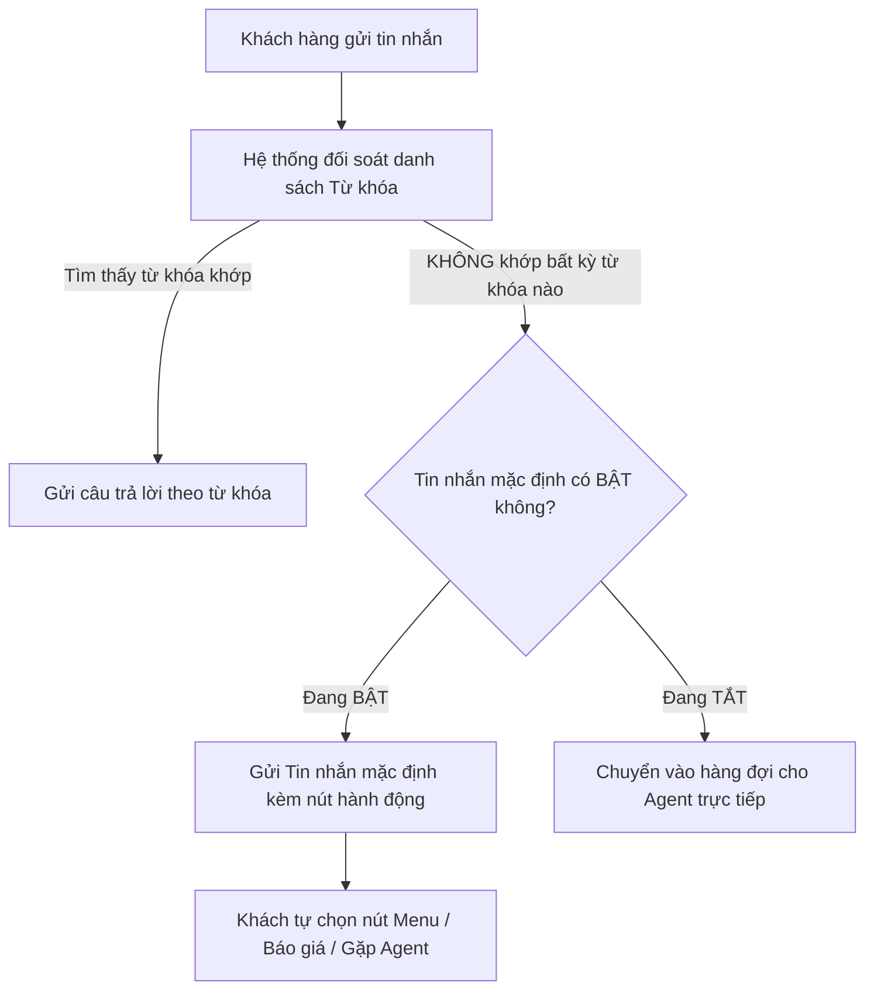

# HƯỚNG DẪN SỬ DỤNG TÍNH NĂNG: TIN NHẮN MẶC ĐỊNH (DEFAULT FALLBACK MESSAGE)

> **Mục tiêu**: Giúp bạn hiểu rõ cơ chế hoạt động, từng bước thiết lập, quản lý và tối ưu hóa **Tin nhắn mặc định** trên nền tảng AntBuddy Automation với giao diện 3 cột hiện đại, mềm mại và trực quan nhất.

---

## 1. Tin nhắn mặc định là gì? Khi nào được kích hoạt?

### 💡 Khái niệm đơn giản
**Tin nhắn mặc định (Default Fallback Message)** là "chiếc lưới an toàn" của hệ thống tự động hóa. 

Khi một khách hàng nhắn tin đến Fanpage/Zalo/Livechat của bạn, hệ thống sẽ tự động quét danh sách **Từ khóa (Keywords)** xem có câu trả lời sẵn nào khớp không. 

👉 **Nếu không tìm thấy từ khóa nào khớp**, hệ thống sẽ lập tức kích hoạt và gửi **Tin nhắn mặc định** này để khách hàng không bị bỏ rơi, đồng thời hướng dẫn khách các bước tiếp theo hoặc chuyển cho tư vấn viên.

### 🔄 Sơ đồ luồng xử lý tự động

---

## 2. Bố cục giao diện Thiết kế luồng (Visual Flow Builder)

Giao diện trang **Tin nhắn mặc định** được thiết kế theo tiêu chuẩn trực quan dạng Canvas Flow Builder:

| Cột 1: Danh sách bước (Flow Steps) | Cột 2: Khung Canvas & Node Editor | Cột 3: Xem trước trên Mobile (Messenger) |
|---|---|---|
| • **BẮT ĐẦU**: Khối khởi đầu luồng (`💬 Nhận thông tin`) viền tím nổi bật. • **NỘI DUNG**: Các bước tiếp theo (`💬 Nội dung #2`). • **TẠO BƯỚC TIẾP THEO**: Nút tạo bước mới `Tạo bước tiếp theo ⊕`. | • **Thanh công cụ Canvas**: Hoàn tác `↶`, Làm lại `↷`, Thêm chữ `T`, Bảo vệ `🛡️`, Lưới `⊞`, Phóng to `⤢`. • **Loại tin nhắn**: Trong khoảng 24 giờ / Ngoài khoảng 24 giờ. • **Khối soạn tin**: Textarea, Emoji `☺`, Biến cá nhân hóa `{ }`, Bộ đếm ký tự `23/640`. • **Nút đính kèm**: `⠿ Thông tin AntBuddy >` kèm nút `Thêm nút ＋`. • **Trả lời nhanh**: Danh sách chip quick replies (`Tôi đã rồi`, `Cảm ơn`) & nút `Trả lời nhanh`. • **Thêm một nội dung (8 loại)**: Văn bản, Hình ảnh, Nhóm ảnh, Bộ sưu tập, Templates, Video, Audio, Nhiều hơn. • **Bước kết nối & Ghi chú**: Dropdown `Chọn bước tiếp theo ⌄` và công tắc `📝 Thêm ghi chú`. | • Khung mô phỏng điện thoại iPhone đồng bộ chuẩn Messenger. • Header Fanpage: `The Ancient Sovereign...` `trả lời ngay lập tức` kèm icon gọi thoại/video. • Bong bóng tin nhắn khách gửi: `tôi cần hỗ trợ`. • Bong bóng phản hồi của Bot: `TAS đã nhận thông tin ạ`. • Nút đính kèm & Chip Trả lời nhanh (`Tôi đã rồi`, `Cảm ơn`) cập nhật tức thời theo thời gian thực. • Thanh tương tác Messenger đầy đủ (Aa, Emoji, Like). |

---

## 3. Hướng dẫn từng bước thao tác (Step-by-Step)

### Bước 1: Bật / Tắt tính năng
* Ở thanh công cụ trên cùng, bạn có nút gạt **`Bật trả lời mặc định`**:
  * **Đang bật (Active - Xanh tím)**: Hệ thống tự động gửi tin nhắn mặc định mỗi khi khách nhắn câu hỏi lạ / không khớp từ khóa.
  * **Đang tắt**: Hệ thống sẽ không gửi tin nhắn tự động mà để tư vấn viên tiếp nhận thủ công.
* Chuyển đổi giữa 2 chế độ xem: **`⚡ Thiết kế luồng`** và **`📊 Thống kê`**.

---

### Bước 2: Soạn thảo tin nhắn & Chọn khung thời gian (Cột 2)
1. **Loại tin nhắn**:
   * **Trong khoảng 24 giờ**: Gửi tin nhắn tương tác tự nhiên trong khung tiêu chuẩn 24h của Meta.
   * **Ngoài khoảng 24 giờ**: Áp dụng thẻ Message Tag cho khách hàng tương tác ngoài 24h.
2. **Nội dung tin nhắn**:
   * Nhập nội dung phản hồi (ví dụ: `TAS đã nhận thông tin ạ`).
   * Sử dụng biểu tượng `☺` để chèn Emoji hoặc `{ }` để chèn thông tin biến cá nhân hóa.

---

### Bước 3: Thêm & Hiệu chỉnh nút lựa chọn (Action Buttons)
1. Nhấp vào nút **`Thêm nút ＋`** hoặc nhấp vào nút `⠿ Thông tin AntBuddy >` để mở modal **Hiệu chỉnh nút**:
   * **TIÊU ĐỀ**: Đặt tên nút hiển thị (ví dụ: `Thông tin AntBuddy`, tối đa 20 ký tự).
   * **HÀNH ĐỘNG KHI NHẤN NÚT**:
     * 💬 **Gửi tin nhắn**: Chuyển tiếp sang khối nội dung tiếp theo (`Nội dung #2`).
     * ⚡ **Luồng có sẵn**: Kích hoạt kịch bản tự động.
     * 🌐 **Website**: Mở link liên kết web an toàn (`https://`).
     * 📞 **Hotline**: Gọi điện trực tiếp.
   * Nhấn nút **`💾 Lưu`** để áp dụng.

---

### Bước 4: Thiết lập Trả lời nhanh (Quick Replies)
* Danh sách chip phản hồi nhanh nằm ngay dưới khối tin nhắn:
  * `Tôi đã rồi` (11/20)
  * `Cảm ơn` (6/20)
* Nhấn nút **`Trả lời nhanh`** để bổ sung thêm các câu gợi ý trả lời nhanh cho khách hàng.

---

### Bước 5: Bổ sung các loại khối nội dung (8 Types Grid)
Bạn có thể linh hoạt nhấp chọn 8 loại định dạng đa phương tiện:
* `[T] Văn bản` | `[🖼️] Hình ảnh` | `[🖼️🖼️] Nhóm ảnh` | `[🗂️] Bộ sưu tập`
* `[📋] Templates` | `[🎥] Video` | `[🎙️] Audio` | `[⊕] Nhiều hơn`

---

### Bước 6: Xem trước trên điện thoại (Cột 3) & Nút "Xem thử"
* **Cột 3 (Phone Preview)**: Màn hình điện thoại phong cách Messenger đồng bộ nội dung, nút bấm và chip trả lời nhanh ngay lập tức.
* **Nút `Xem thử`**: Nhấn nút "Xem thử" ở thanh tiêu đề để mở trình giả lập hội thoại (Sandbox) thử nghiệm hội thoại thực tế.

---

### Bước 7: Lưu & Áp dụng
* Nhấn nút **`Lưu & áp dụng`** để ghi nhận toàn bộ luồng kịch bản vào hệ thống.
* Nếu muốn xóa bỏ tin nhắn mặc định và quay lại trạng thái tạo ban đầu, nhấn nút **`Xóa tin nhắn`**.
